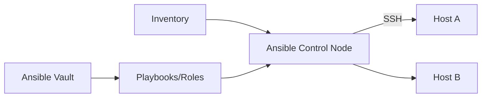

# Ansible

## 1. Overview

**What it is:** Agentless configuration management over SSH (or winrm) using declarative YAML playbooks.

**When to use:** Bootstrap hosts, patch configs, install agents, hybrid with Terraform (TF creates VM, Ansible configures).

**When NOT to use:** Immutable container images as source of truth (bake in CI instead); cloud resource provisioning (Terraform).

## 2. Concepts

- **Inventory** — hosts/groups (static.ini or dynamic)
- **Playbook** — plays mapping hosts → tasks
- **Role** — reusable tasks/handlers/templates/defaults
- **Collection** — packaged roles/modules/plugins
- **Module** — unit of work (`copy`, `apt`, `systemd`)
- **Handler** — notified restart on change
- **Jinja2 templates**
- **Variables** — precedence is complex; prefer role defaults + group_vars
- **Vault** — encrypt secrets at rest in git
- **Idempotency** — re-run yields same state

## 3. Architecture



## 4. Production Best Practices

- Idempotent tasks; use `creates`/`changed_when` thoughtfully
- Roles + collections versioned; molecule tests for roles
- Vault or external secret lookup — not plaintext
- Limit prod with `--limit` and change windows
- Check mode (`--check`) + diff in CI where safe
- Prefer pushing config from CI over long-lived bastion pets

## 5. Common Mistakes

| Mistake | Symptoms | Fix |
|---------|----------|-----|
| Non-idempotent shell | Flaky reruns | Prefer modules |
| Broad `hosts: all` | Accidental blast | Explicit groups |
| Vault password in CI plaintext | Leak | OIDC → secret manager |
| Ignoring variable precedence | Wrong values | Simplify vars |

## 6. Debugging Guide

```bash
ansible -i inv all -m ping
ansible-playbook site.yml -vvv --limit web01
ansible-doc apt
ansible-inventory -i inv --list
```

## 7. Security

- SSH keys or SSM; disable password auth
- Vault encrypted files; rotate vault IDs
- Least privilege become/sudo
- Don't log secrets (`no_log: true`)

## 8. Performance

- Mitogen/SSH pipelining; fact caching
- Serial/rolling batches for restarts
- Break huge plays; use tags

## 9. Real Production Example

Packer builds AMI with Ansible roles (CIS hardening, agents); Terraform launches ASG from AMI; Ansible used rarely for emergency config — preference for re-bake.

## 10. Interview Questions

**Beginner:** Agentless meaning? Handler vs task?

**Intermediate:** Variable precedence? Dynamic inventory?

**Senior:** Ansible at 10k nodes. Idempotency testing strategy. TF+Ansible boundary.

## 11. Checklist

- [ ] Inventory groups clear
- [ ] Vault/secrets OK
- [ ] Check mode in CI
- [ ] Roles tested (molecule)
- [ ] Rolling update strategy

## 12. Cheat Sheet

```bash
ansible-galaxy collection install community.general
ansible-playbook -i inv site.yml --tags web --check
ansible-vault edit group_vars/prod/vault.yml
```

## Related Skills

- [terraform](../terraform/SKILL.md)
- [linux](../linux/SKILL.md)
- [security](../security/SKILL.md)
- [secrets-management](../secrets-management/SKILL.md)

---

**Author & maintainer:** Shanmukha Kumar Karra  
*Created and maintained as part of [AgentOps Kit](https://github.com/Shannuu2409/agentops-kit).*
