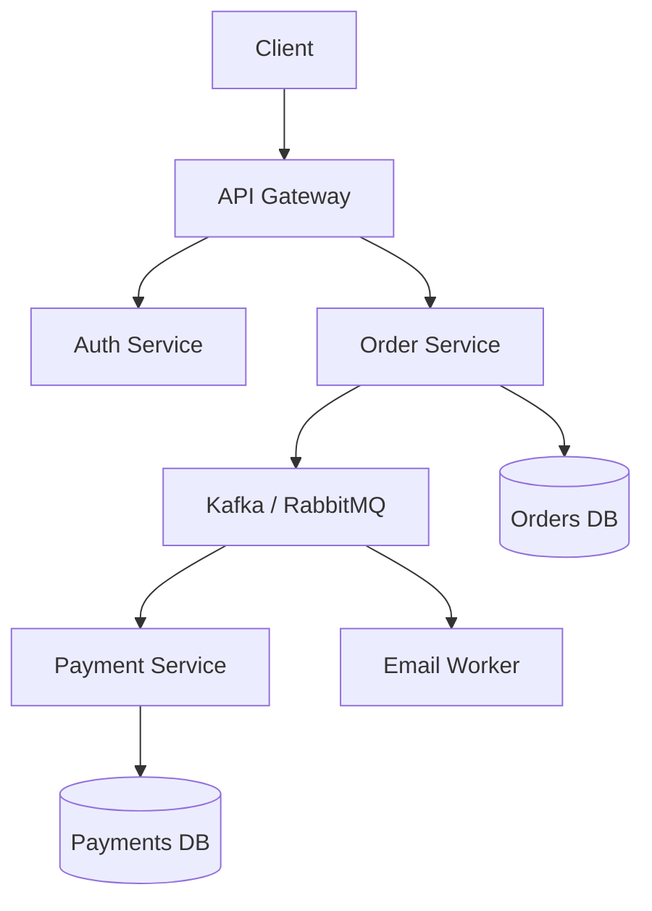

# Architecture

## 1. Overview

**What it is:** Structural decisions about how components communicate, scale, and fail.

**DevOps angle:** Architecture determines deployability, observability, blast radius, and toil.

**When to use:** New systems, major rewrites, platform standards.

**When NOT to:** Microservices by default for a 3-person team — complexity is a cost.

## 2. Concepts

- **Monolith** — one deployable; simple ops early
- **Microservices** — independent deploy; distributed failure modes
- **Modular monolith** — boundaries without network
- **Event-driven** — async facts/events
- **Message queues** — RabbitMQ (commands/queues), Kafka (log/stream)
- **API Gateway** — north-south entry
- **Service discovery** — DNS, Consul, K8s Services
- **CQRS / saga** — advanced consistency patterns
- **Twelve-Factor** — config/logs/disposability

## 3. Architecture

## 4. Production Best Practices

- Choose simplest architecture that meets scale/team needs
- Explicit contracts (OpenAPI/AsyncAPI); versioning
- Idempotent consumers; outbox pattern for reliable events
- Define failure domains and ownership
- Standardize platform (auth, telemetry, CI) so services don't reinvent
- Data ownership per service — no shared mutable DB across teams casually

## 5. Common Mistakes

| Mistake | Impact | Fix |
|---------|--------|-----|
| Distributed monolith | Worst of both | Real boundaries or merge |
| Chatty sync calls | Latency/cascades | Bulkhead + async |
| Shared DB | Coupling | Split ownership |
| No correlation IDs | Unoperable | Platform middleware |

## 6. Debugging Guide

Map dependency graph; find timeout cascades; check queue lag; verify contract versions between producer/consumer.

## 7. Security

- Zero-trust service identity
- Gateway authn; service authz
- Least privilege data stores
- Threat model trust boundaries

## 8. Performance

- Avoid unnecessary hops
- Cache at right layer
- Partition Kafka by key carefully
- Backpressure for consumers

## 9. Real Production Example

Modular monolith initially; extract payment service when team/scale justified; Kafka for order events; Kong gateway; shared platform Helm library for telemetry/auth.

## 10. Interview Questions

**Beginner:** Monolith vs microservices?

**Intermediate:** When Kafka vs RabbitMQ?

**Senior:** Design migration from monolith without big-bang. Multi-region consistency.

## 11. Checklist

- [ ] Goals & constraints written
- [ ] Boundaries & data ownership clear
- [ ] Failure modes documented
- [ ] Observability standard
- [ ] Deploy/rollback story per component

## 12. Cheat Sheet

| Style | Strength | Weakness |
|-------|----------|----------|
| Monolith | Simple ops | Scale teams/deploy |
| Microservices | Independent deploy | Distributed complexity |
| Events | Decoupling | Eventual consistency |

## Related Skills

- [cicd](../cicd/SKILL.md)
- [kubernetes](../kubernetes/SKILL.md)
- [kong](../kong/SKILL.md)
- [observability](../observability/SKILL.md)
- [databases](../databases/SKILL.md)
