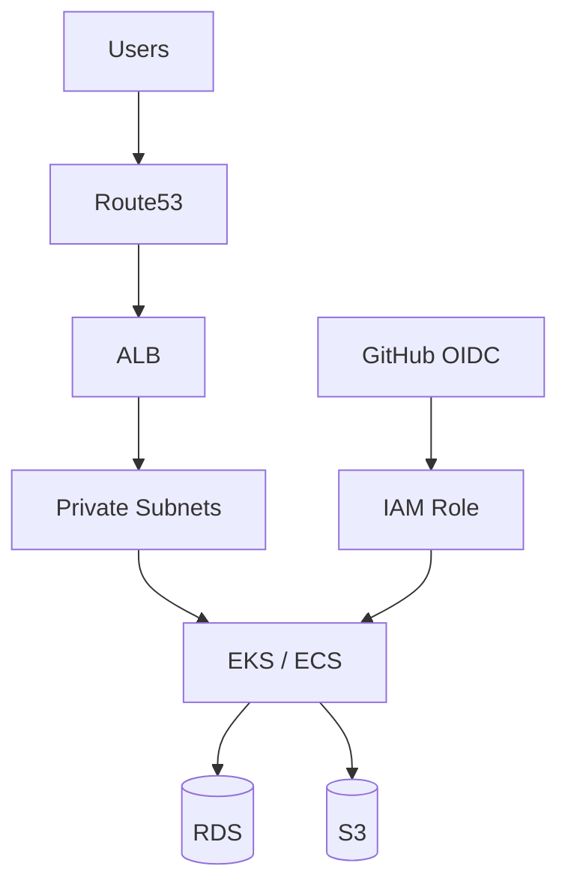

# AWS

## 1. Overview

**What it is:** Amazon Web Services — IaaS/PaaS building blocks for compute, network, data, and ops.

**When to use:** Cloud workloads needing global regions, managed K8s/ECS, durable object storage.

**When NOT to use:** Strict on-prem only; when another cloud is already standardized (avoid accidental multi-cloud complexity).

## 2. Concepts

| Service | Role |
|---------|------|
| **IAM** | Users/roles/policies — least privilege |
| **VPC** | Isolated network, subnets, routing |
| **EC2** | VMs |
| **ECS/Fargate** | Container orchestration (AWS-native) |
| **EKS** | Managed Kubernetes |
| **S3** | Object storage |
| **ALB/NLB** | L7 / L4 load balancing |
| **Route53** | DNS |
| **CloudWatch** | Metrics, logs, alarms |
| **STS / OIDC** | Short-lived credentials |

## 3. Architecture



## 4. Production Best Practices

- Multi-AZ; prefer managed control planes
- IAM roles for EC2/IRSA — no long-lived keys on disks
- SCPs in AWS Organizations; separate prod accounts
- Encrypt everything (S3 SSE, EBS, RDS)
- VPC endpoints for S3/ECR to cut NAT cost/exposure
- Tagging strategy for cost and ownership
- CloudTrail organization trail mandatory

## 5. Common Mistakes

| Mistake | Symptoms | Fix |
|---------|----------|-----|
| `*:*` IAM | Breach blast | Scope actions/resources |
| Public S3 ACL | Data leak | Block Public Access |
| Single AZ | Outage | Multi-AZ |
| Keys in GitHub secrets forever | Leak | OIDC |
| Open 0.0.0.0/0 SSH | Scans | SSM / restricted SG |

## 6. Debugging Guide

```bash
aws sts get-caller-identity
aws logs tail /aws/eks/cluster --follow
aws ec2 describe-security-groups --group-ids sg-...
aws elbv2 describe-target-health --target-group-arn ...
```

Check: IAM deny vs network timeout (different symptoms).

## 7. Security

- GuardDuty, Security Hub, Config rules
- Secrets Manager / SSM Parameter Store
- WAF on ALB; Shield as needed
- ECR image scanning; private ECR
- Least privilege IRSA trust policies

## 8. Performance

- Right-size + Savings Plans after metrics
- ALB target locality; connection idle timeouts
- S3 Transfer Acceleration / CloudFront for global read
- EKS: Karpenter binpack; AZ-aware topology

## 9. Real Production Example

Org with log/security/prod/dev accounts; Terraform landing zone; EKS + IRSA; ALB + WAF; Route53 + ACM; CloudWatch + Managed Prometheus; CI OIDC deploy role with environment constraints.

## 10. Interview Questions

**Beginner:** SG vs NACL? IAM user vs role?

**Intermediate:** ALB vs NLB? IRSA setup?

**Senior:** Multi-account network (TGW). Blast-radius IAM. Cost+security tradeoffs NAT vs endpoints.

## 11. Checklist

- [ ] Org trail + GuardDuty
- [ ] S3 BPA; encryption defaults
- [ ] No long-lived keys for CI
- [ ] Multi-AZ critical paths
- [ ] Budgets/alerts

## 12. Cheat Sheet

| CLI | Purpose |
|-----|---------|
| `aws sts get-caller-identity` | Who am I |
| `aws eks update-kubeconfig` | Kube context |
| `aws s3 ls` | List buckets |
| `aws logs filter-pattern` | Search logs |

## Related Skills

- [terraform](../terraform/SKILL.md)
- [kubernetes](../kubernetes/SKILL.md)
- [networking](../networking/SKILL.md)
- [security](../security/SKILL.md)
- [monitoring](../monitoring/SKILL.md)
