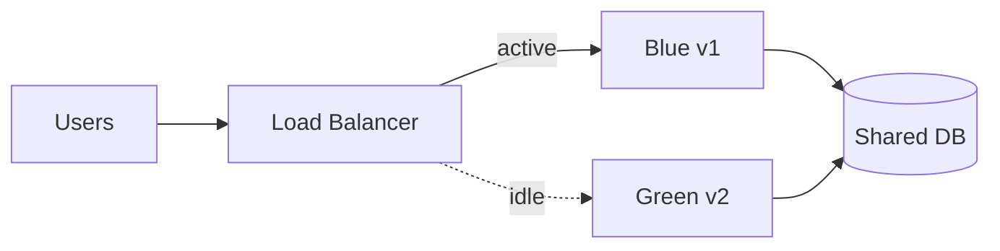
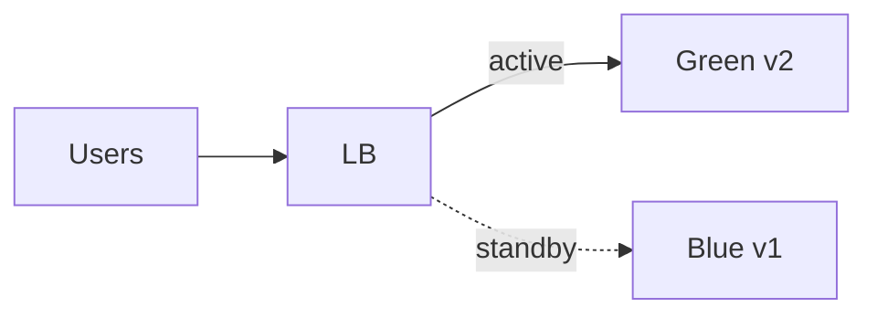

# Blue-Green Deployment

## 1. Overview

**What it is:** Run two production environments (**Blue** = current, **Green** = new). Deploy and test Green, then switch traffic atomically (or near-atomically) from Blue to Green.

**Why it exists:** Minimize downtime and enable instant rollback by switching traffic back.

**When to use:** Need fast rollback; dual capacity affordable; DB schema compatible with both during cutover.

**When NOT to:** Cost-prohibitive double capacity; long-lived incompatible dual writes without migration plan — consider canary or expand-contract first.

## 2. Concepts

- **Blue / Green slots** — identical stacks different versions
- **Router / LB switch** — weighted or 100% cutover
- **Smoke / synthetic tests** on idle color before switch
- **Sticky sessions** — drain before switch if stateful
- **Shared services** — DB, queues must support both versions briefly
- Related: **rolling**, **canary**, **recreate**, **A/B**, **shadow**

## 3. Architecture

After cutover:

## 4. Production Best Practices

- Automate smoke tests against Green before flip
- Keep Blue warm for rapid rollback window (N hours)
- Feature flags for risky behavior beyond binary switch
- Ensure migrations are backward/forward compatible
- Document who can flip traffic and under what criteria
- Monitor error rate/latency during and after switch

## 5. Common Mistakes

| Mistake | Symptoms | Fix |
|---------|----------|-----|
| Breaking schema change first | Green fails or Blue breaks after | Expand-contract migrations |
| No smoke on Green | Bad release at 100% | Automated pre-flight |
| Instant destroy Blue | Can't rollback | Retain window |
| Session affinity ignored | User errors | Drain connections |

## 6. Debugging Guide

- Confirm which color serves (`X-Env` header or target group)
- Compare target health on both pools
- Diff configs/secrets between colors
- Rollback = point LB to previous color; verify metrics

## 7. Security

- Identical security controls both colors
- Don't leave old color publicly routable with outdated vulns longer than policy
- Audit trail of traffic switches

## 8. Performance

- Pre-warm Green (JVM/caches/CDN)
- Capacity equal to Blue before cutover under peak
- DNS TTL considerations if switching at DNS layer (prefer LB weights)

## 9. Real Production Example

ECS two target groups; CodeDeploy blue/green; hooks run integration tests; flip; CloudWatch alarms auto-rollback to Blue within 15 minutes if 5xx spike.

## 10. Interview Questions

**Beginner:** What problem does blue-green solve?

**Intermediate:** How do DB migrations work with blue-green?

**Senior:** Blue-green across regions with data replication lag.

## 11. Checklist

- [ ] Dual environment ready + smoke tests
- [ ] Compatible migrations
- [ ] Rollback window defined
- [ ] Alarms + auto/manual rollback
- [ ] Runbook for sticky sessions/drain

## 12. Cheat Sheet

| Platform | Mechanism |
|----------|-----------|
| AWS ALB | Two target groups + weighted forward |
| K8s | Two Deployments + Service selector flip / Ingress canary weights |
| DNS | Weighted records (slower due to TTL) |

## Related Skills

- [canary-deployment](../canary-deployment/SKILL.md)
- [rollback-strategies](../rollback-strategies/SKILL.md)
- [cicd](../cicd/SKILL.md)
- [load-balancing](../load-balancing/SKILL.md)

---

**Author & maintainer:** Shanmukha Kumar Karra  
*Created and maintained as part of [AgentOps Kit](https://github.com/Shannuu2409/agentops-kit).*
