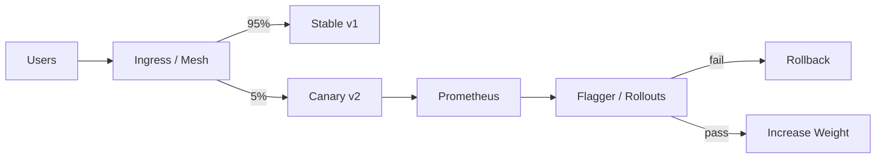

# Canary Deployment

## 1. Overview

**What it is:** Send a **small percentage** of traffic to the new version, watch SLOs, then gradually increase to 100% or abort.

**Why it exists:** Limits blast radius vs all-at-once; catches issues blue-green might only see under real traffic mix.

**When to use:** High-traffic services; uncertain changes; need progressive confidence.

**When NOT to:** Tiny user base (stats noisy); changes that must be atomic for correctness (financial cutover) without careful design.

## 2. Concepts

- **Baseline vs canary** replicas
- **Traffic split** — header/cookie/weight (Istio, Nginx, ALB, Flagger)
- **Analysis** — success rate, p99, custom metrics
- **Step schedule** — 5% → 25% → 50% → 100%
- **Abort / rollback** — automatic on threshold breach
- **A/B** — experiment by cohort; **shadow** — mirror traffic without serving responses to users
- **Progressive delivery** — umbrella term; often with feature flags

## 3. Architecture

## 4. Production Best Practices

- Automate analysis — don't babysit every release
- Enough traffic at each step for statistical meaning
- Separate canary **errors from deploy** vs bad metrics flukes (use multiple windows)
- Combine with feature flags for darker launches
- Include business KPIs (checkout success) not only CPU

## 5. Common Mistakes

| Mistake | Symptoms | Fix |
|---------|----------|-----|
| 1% of tiny traffic | False confidence | Longer steps / synthetic |
| Only CPU gates | Miss functional bugs | RED metrics + synthetics |
| Sticky sessions skew | Biased canary | Appropriate affinity |
| Manual steps forgotten | Partial deploys | Controllers (Flagger) |

## 6. Debugging Guide

- Compare canary vs stable dashboards side-by-side
- Check traffic weight actual vs desired
- Inspect analysis run logs (Flagger/Argo)
- Reproduce with canary header if header-based split

## 7. Security

- Canary must not skip auth/WAF
- Restrict who can bypass to canary via headers in prod
- Same image signing policy

## 8. Performance

- Scale canary enough to avoid overload at higher weights
- Warmup period before analysis starts

## 9. Real Production Example

Argo Rollouts AnalysisTemplate on p99 and 5xx; steps 10/25/50/100; Slack notifications; auto abort; Datadog metrics provider.

## 10. Interview Questions

**Beginner:** Canary vs blue-green?

**Intermediate:** How to split traffic in Kubernetes?

**Senior:** Design analysis to avoid flapping. Canary with non-idempotent writes.

## 11. Checklist

- [ ] Metrics + thresholds defined
- [ ] Automated abort
- [ ] Step schedule documented
- [ ] Dashboards compare versions
- [ ] Rollback tested

## 12. Cheat Sheet

| Tool | Notes |
|------|-------|
| Flagger | Automates progressive delivery |
| Argo Rollouts | Canary/blue-green CRDs |
| Istio/Linkerd | Weight-based routes |
| Nginx Ingress | `canary-weight` annotations |

## Related Skills

- [blue-green-deployment](../blue-green-deployment/SKILL.md)
- [rollback-strategies](../rollback-strategies/SKILL.md)
- [cicd](../cicd/SKILL.md)
- [observability](../observability/SKILL.md)
- [service-mesh](../service-mesh/SKILL.md)
