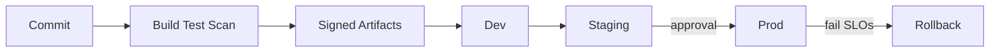

# CI/CD

## 1. Overview

**What it is:** **Continuous Integration** merges and verifies often; **Continuous Delivery/Deployment** gets verified artifacts to environments safely.

**When to use:** Any team shipping software more than rarely.

**When NOT to:** Fully automated prod deploy without tests/observability — that's recklessness, not CD.

## 2. Concepts

Pipeline stages typically:
1. **Build** — compile/image
2. **Test** — unit/integration/e2e
3. **Security** — SAST/SCA/image/secret scan
4. **SBOM + sign** — attest provenance
5. **Publish** — artifact registry
6. **Deploy** — progressive strategies
7. **Verify** — smoke/synth checks
8. **Rollback** — automatic or one-click
9. **Notify** — Slack/Pager

**Approval gates** — humans for prod risk. **Environments** — promotion path.

## 3. Architecture

## 4. Production Best Practices

- Trunk-based or short-lived branches; fast main
- Same artifact promoted (no rebuild for prod)
- Progressive delivery (canary/blue-green)
- Automate rollback on health regression
- Pipeline as code; required checks on PRs
- Separate credentials per environment

## 5. Common Mistakes

| Mistake | Symptoms | Fix |
|---------|----------|-----|
| Rebuild per env | Drift | Promote digest |
| Tests only local | Broken main | Required CI |
| Manual prod SSH | Snowflakes | GitOps/CD |
| No rollback plan | Long outages | Documented revert |
| Skipping scans "for speed" | Vulns in prod | Parallelize scans |

## 6. Debugging Guide

- Identify failing stage; isolate flake vs real
- Re-run with debug; compare last green commit
- Artifact mismatch: verify digest between stages
- Deploy fail: see [troubleshooting](../troubleshooting/SKILL.md)

## 7. Security

- Least privilege CI roles; OIDC
- Protected environments; signed commits optional
- No secret echo; masked variables
- Provenance (SLSA) for critical systems

## 8. Performance

- Parallel jobs; test sharding; remote build cache
- Path filters in monorepos
- Ephemeral premium runners only when needed

## 9. Real Production Example

PR → CI; main → build once → staging auto; prod canary via Argo Rollouts; automated abort; Slack + change ticket link; SBOM stored with release.

## 10. Interview Questions

**Beginner:** CI vs CD?

**Intermediate:** Why promote same artifact?

**Senior:** Design CD for regulated industry with approvals and evidence.

## 11. Checklist

- [ ] Required checks + coverage gates
- [ ] Scan + SBOM + sign
- [ ] Promotion by digest
- [ ] Rollback tested
- [ ] Notifications + owners

## 12. Cheat Sheet

| Stage | Tooling examples |
|-------|------------------|
| CI | GitHub Actions, GitLab CI |
| Scan | Trivy, CodeQL, Semgrep |
| Deploy | Argo CD, Flux, Spinnaker |
| Progressive | Flagger, Argo Rollouts |

## Related Skills

- [github-actions](../github-actions/SKILL.md)
- [docker](../docker/SKILL.md)
- [blue-green-deployment](../blue-green-deployment/SKILL.md)
- [canary-deployment](../canary-deployment/SKILL.md)
- [rollback-strategies](../rollback-strategies/SKILL.md)
- [security](../security/SKILL.md)
