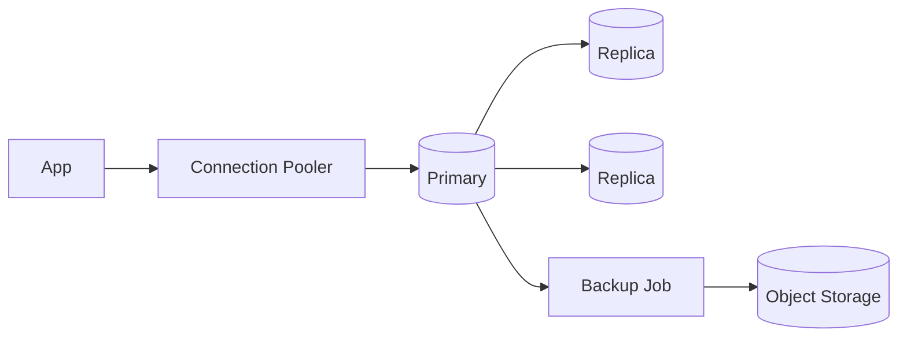

# Databases

## 1. Overview

**What it is:** Stateful systems storing application data — relational (MySQL/Postgres), document (MongoDB), cache/queue-ish (Redis).

**When to use:** Persist business data; cache hot paths; session/feature store.

**When NOT to:** Use Redis as sole durable store for critical data without persistence strategy; run prod DB in a random container without volumes/backups.

## 2. Concepts

- **OLTP vs OLAP**
- **Replication** — primary/replicas; lag
- **Failover** — automatic vs manual
- **Backups** — full/incremental/PITR; restore drills
- **Migrations** — Flyway/Liquibase/golang-migrate; expand-contract
- **Connection pooling** — PgBouncer, ProxySQL
- **Indexes & EXPLAIN**
- **Transactions / isolation levels**

## 3. Architecture



## 4. Production Best Practices

- Managed DB when possible (RDS/Aurora/Cloud SQL)
- Multi-AZ; automated backups + tested restores
- Migrations backward-compatible for rolling deploys
- Separate migration CI role; never app god-mode grants
- Monitor lag, connections, disk, slow queries
- Redis: eviction policy conscious; persistence mode known

## 5. Common Mistakes

| Mistake | Symptoms | Fix |
|---------|----------|-----|
| Migrate breaking column drop early | App errors mid-deploy | Expand-contract |
| No pool limits | DB connection storm | Pool + app limits |
| Untested backups | Restore fails in incident | Quarterly restore game day |
| Index every column | Write slowness | Measure with EXPLAIN |

## 6. Debugging Guide

```bash
# Postgres examples
SELECT * FROM pg_stat_activity;
SELECT now()-pg_last_xact_replay_timestamp();  # lag on replica
EXPLAIN ANALYZE SELECT ...;
redis-cli INFO replication
```

Connectivity: DNS, SG/NACL, TLS required, password rotation mismatch.

## 7. Security

- Private subnets; TLS to DB
- IAM auth where supported
- Encrypt at rest; audit logging
- Least-privilege DB users per app
- Scrub prod data in non-prod

## 8. Performance

- Right indexes; avoid N+1
- Read replicas for read-heavy
- Vacuum/analyze (Postgres)
- Redis pipelining; key design

## 9. Real Production Example

Aurora Postgres Multi-AZ; PgBouncer; Flyway in CD before Rollout; logical replication to analytics; nightly snapshot + continuous PITR; restore test monthly.

## 10. Interview Questions

**Beginner:** Primary vs replica? What is an index?

**Intermediate:** Expand-contract migrations? Isolation levels?

**Senior:** Zero-downtime major version upgrade. Multi-region active-active conflicts.

## 11. Checklist

- [ ] Backups + restore tested
- [ ] Multi-AZ / HA
- [ ] Migration strategy compatible with rolling deploys
- [ ] Monitoring + connection limits
- [ ] Encryption + private access

## 12. Cheat Sheet

| Tool | Use |
|------|-----|
| Flyway/Liquibase | Schema migrations |
| `pg_dump` / `mysqldump` | Logical backup |
| PgBouncer | Pooling |
| `EXPLAIN ANALYZE` | Query plans |

## Related Skills

- [disaster-recovery](../disaster-recovery/SKILL.md)
- [performance](../performance/SKILL.md)
- [security](../security/SKILL.md)
- [troubleshooting](../troubleshooting/SKILL.md)
