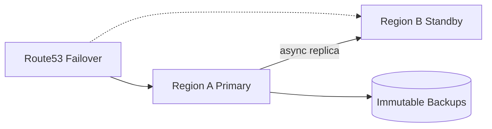

# Disaster Recovery

## 1. Overview

**What it is:** Preparing to restore service after major failures — region loss, ransomware, data corruption, human error.

**Key metrics:**
- **RTO** — Recovery Time Objective (how long downtime allowed)
- **RPO** — Recovery Point Objective (how much data loss allowed)

**When to use:** Always for critical systems; tier services by business impact.

**When NOT to:** Paying for active-active multi-region when RTO of hours and backups suffice — match cost to business need.

## 2. Concepts

- **Backup** vs **replication** vs **archive**
- **Pilot light / warm standby / hot-hot**
- **Multi-AZ** (typical) vs **multi-region** (harder)
- **Runbooks + game days**
- **Chaos engineering** (controlled)
- **Immutable backups** / vaulting against ransomware

## 3. Architecture

## 4. Production Best Practices

- Define RTO/RPO per service tier in writing
- Automate backups; **test restores** on schedule
- Document DNS/IAM/secrets dependencies in DR region
- Infrastructure as code to rebuild
- Separate backup accounts/credentials
- Post-incident: blameless + improve RTO evidence

## 5. Common Mistakes

| Mistake | Symptoms | Fix |
|---------|----------|-----|
| Untested backups | Restore fails | Game day |
| Only AZ, think region-safe | Regional outage | True DR plan |
| Secrets only in one region | Can't start DR | Replicate secrets |
| No ownership | Drifted docs | Assign DR owner |

## 6. Debugging Guide

During DR: declare incident commander; follow runbook order (data → platform → apps → DNS); verify checksums/lag; communicate ETA.

## 7. Security

- Immutable/WORM backups; MFA delete
- Encrypt backups; test key access in DR
- Least privilege break-glass accounts

## 8. Performance

- Replication lag monitoring = RPO reality
- Capacity in DR must meet peak or accept degraded mode

## 9. Real Production Example

Tier-0: Aurora Global + Route53 health failover; tier-1: daily snapshots RTO 4h; quarterly region failover game day with scorecard.

## 10. Interview Questions

**Beginner:** RTO vs RPO?

**Intermediate:** Pilot light vs warm standby?

**Senior:** Design DR for active-active with conflict resolution.

## 11. Checklist

- [ ] Tiered RTO/RPO
- [ ] Backups immutable + restore tested
- [ ] Runbook + contacts current
- [ ] DR IAM/secrets/DNS ready
- [ ] Last game day < 6 months

## 12. Cheat Sheet

| Pattern | RTO | Cost |
|---------|-----|------|
| Backup/restore | Hours+ | Low |
| Pilot light | Tens of min | Medium |
| Warm standby | Minutes | High |
| Hot-hot | Seconds | Highest |

### Game day script (minimal)

1. Pick a tier-1 service
2. Restore latest backup to isolated env
3. Measure wall-clock vs RTO
4. Validate data vs RPO (row counts, checksum sample)
5. Record gaps; file tickets; retest next quarter

## Related Skills

- [databases](../databases/SKILL.md)
- [aws](../aws/SKILL.md)
- [rollback-strategies](../rollback-strategies/SKILL.md)
- [dns](../dns/SKILL.md)
