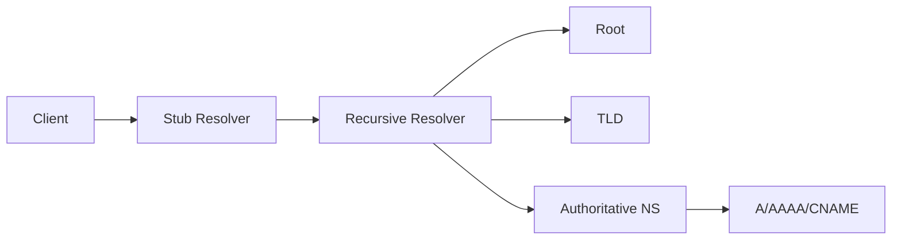

# DNS

## 1. Overview

**What it is:** The Internet's phonebook — names map to records (IPs, aliases, text).

**When to use:** Every service exposure, service discovery, certificate validation (HTTP-01/DNS-01).

**When NOT to:** Using DNS as a rapid failover mechanism without understanding TTL caching.

## 2. Concepts

- **Recursive resolver** vs **authoritative** nameserver
- **Records:** A/AAAA, CNAME, MX, TXT, NS, SRV, CAA, PTR
- **TTL** — cache duration
- **CNAME flattening / ALIAS** at apex
- **Split-horizon / private zones**
- **DNSSEC** (optional integrity)
- **Health checks + failover** (Route53)

## 3. Architecture



## 4. Production Best Practices

- Lower TTL before migrations; raise after stable
- Infrastructure as code for zones
- CAA records to limit cert issuers
- Separate public/private zones
- Monitor resolution and NXDOMAIN spikes
- Document ownership of zones

## 5. Common Mistakes

| Mistake | Symptoms | Fix |
|---------|----------|-----|
| High TTL cutover | Users on old IP | Pre-lower TTL |
| CNAME at apex wrongly | Breaks zone | ALIAS/ANAME/flatten |
| Stale cache in apps | Wrong upstream | Restart/ttl respect |
| Missing glue | Delegation fail | Fix parent NS |

## 6. Debugging Guide

```bash
dig api.example.com +trace
dig @8.8.8.8 api.example.com A
dig api.example.com CNAME
resolvectl query api.example.com   # systemd-resolved
nslookup api.example.com
```

CoreDNS in K8s: `kubectl -n kube-system logs -l k8s-app=kube-dns`

## 7. Security

- DNSSEC where required
- Protect registrar accounts (MFA)
- Monitor zone changes
- DNS-based auth challenges carefully
- Block internal zone leakage

## 8. Performance

- Sensible TTLs; CDN for static
- Anycast DNS providers
- Avoid tiny TTLs forever (query load)

## 9. Real Production Example

Route53 public + private hosted zones; Terraform records; ACM DNS-01; weighted cutover for blue-green; health-check failover to DR region.

## 10. Interview Questions

**Beginner:** What is TTL? A vs CNAME?

**Intermediate:** Why can't CNAME coexist with other data at a name?

**Senior:** Global traffic management design. DNS for zero-downtime migration.

## 11. Checklist

- [ ] TTL strategy for change windows
- [ ] CAA + registrar MFA
- [ ] Private/public split correct
- [ ] Monitoring on critical names
- [ ] Runbook for cutover

## 12. Cheat Sheet

| Command | Purpose |
|---------|---------|
| `dig +short` | Quick answer |
| `dig +trace` | Full delegation path |
| `dig MX` | Mail records |

## Related Skills

- [networking](../networking/SKILL.md)
- [ssl](../ssl/SKILL.md)
- [load-balancing](../load-balancing/SKILL.md)
- [disaster-recovery](../disaster-recovery/SKILL.md)
- [troubleshooting](../troubleshooting/SKILL.md)
