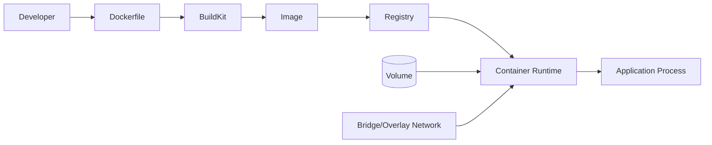
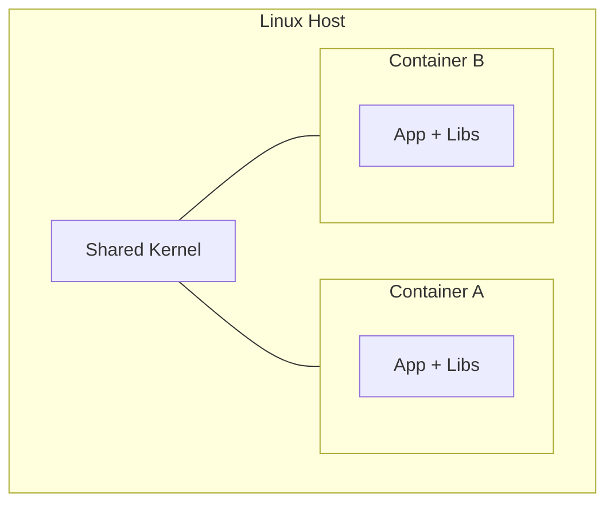

# Docker

## 1. Overview

**What it is:** Docker packages an application and its dependencies into a portable **container** that runs the same way on a laptop, CI runner, or production host.

**Why it exists:** "It works on my machine" fails because OS packages, library versions, and configs differ. Containers isolate the app filesystem and process tree while sharing the host kernel.

**Problems it solves:**
- Consistent builds across environments
- Faster onboarding (one `docker compose up`)
- Efficient packing of many services on one host vs full VMs
- Cleaner CI artifacts (immutable images)

**When to use:** Microservices, CI build/test agents, local multi-service stacks, packaging apps for Kubernetes.

**When NOT to use:** Hard real-time / kernel-module workloads; apps that need full VM isolation for compliance; simple single-binary tools where a container adds no value.

## 2. Concepts

### Containers vs VMs
A **VM** virtualizes hardware and runs a full guest OS. A **container** shares the host kernel and isolates with Linux namespaces + cgroups. Start time is seconds, not minutes.

### Images and layers
An **image** is a read-only filesystem snapshot built from a Dockerfile. Each instruction (`RUN`, `COPY`) creates a **layer**. Layers are cached and shared — change only the last `COPY` and earlier layers reuse cache.

### Build context
Everything sent to the daemon when you `docker build`. Always use a tight `.dockerignore` so `node_modules`, `.git`, and secrets are never in context.

### Registry
Stores and distributes images (`docker.io`, ECR, GHCR, private Harbor). Tag immutably (`app:1.4.2` or digest `@sha256:...`), not only `:latest`.

### Volumes
Persist data outside the container lifecycle. Prefer **named volumes** for databases; bind mounts for local dev only.

### Networks
- **bridge** — default single-host network; containers resolve by name on user-defined bridges
- **host** — share host network stack (fast, less isolation)
- **overlay** — multi-host (Swarm); Kubernetes uses its own CNI instead

### Multi-stage builds
Build in a fat stage, copy only the binary/artifacts into a slim runtime stage. Cuts image size and attack surface.

### BuildKit / buildx
Modern builder: parallel stages, better caching, secrets mounts, multi-platform (`linux/amd64,linux/arm64`).

### Healthchecks
`HEALTHCHECK` tells orchestrators the process is up *and* ready (HTTP `/health`, TCP probe). Kubernetes prefers its own probes; still useful for Compose.

## 3. Architecture





## 4. Production Best Practices

| Practice | Why | Risk if skipped |
|----------|-----|-----------------|
| Pin base images by digest | Reproducible, supply-chain safety | Silent base drift / CVEs |
| Non-root USER | Least privilege | Container escape impact |
| Multi-stage + distroless/alpine carefully | Smaller attack surface | Missing CA certs / debugging tools |
| `.dockerignore` | Faster builds, no secret leak | Leaked `.env` in layers |
| Read-only rootfs + tmpfs | Hardens runtime | Breaks apps writing to `/` |
| Resource limits (`mem`/`cpu`) | Prevent noisy neighbors | Host OOM |
| Scan with Trivy; SBOM with Syft; sign with Cosign | Shift-left security | Shipping known CVEs |
| Immutable tags + digest pulls in prod | Exact deploy | Unexpected `:latest` swaps |

Industry defaults: OCI images, BuildKit on, no secrets in `ENV`/`ARG` that persist in history, prefer BuildKit `--secret` / `--mount=type=secret`.

## 5. Common Mistakes

| Mistake | Symptoms | Root cause | Fix | Prevention |
|---------|----------|------------|-----|------------|
| Fat images | Slow pulls, huge registry bill | Single-stage `node`/`maven` base | Multi-stage; copy artifact only | Image size CI gate |
| Running as root | Security findings | Default USER | `USER 10001` + non-root base | Policy (OPA/Kyverno) |
| Secrets in Dockerfile | Secret in `docker history` | `ENV PASSWORD=` | BuildKit secrets / runtime injection | Pre-commit secret scan |
| Using `:latest` in prod | Mystery regressions | Mutable tag | Semver + digest | Admission controller |
| Huge build context | Builds take minutes | No `.dockerignore` | Ignore deps/git | Template `.dockerignore` |
| Logging to files only | Empty `docker logs` | App writes to file | Log to stdout/stderr | 12-factor checklist |

## 6. Debugging Guide

**Inspect running container**
```bash
docker ps -a
docker logs -f --tail=200 <id>
docker inspect <id>          # Config, mounts, IP, Health
docker exec -it <id> sh      # or bash if present
docker stats                 # CPU/mem live
```

**Image / layer issues**
```bash
docker history --no-trunc <image>
docker image inspect <image>
dive <image>                 # optional: layer waste explorer
```

**Network**
```bash
docker network ls
docker network inspect <net>
docker run --rm --network <net> nicolaka/netshoot
```

**Expected:** healthy status, listening on declared port, logs on stdout.  
**Failure examples:** `exec format error` (wrong arch), `permission denied` (non-root + wrong file mode), `no space left on device` (prune images).

```bash
docker system df
docker system prune -af --volumes   # DANGEROUS in prod — confirm first
```

## 7. Security

- **Secrets:** never bake into layers; use orchestrator secrets / vault agents
- **Least privilege:** drop capabilities (`--cap-drop=ALL`), no `--privileged`
- **Rootless Docker:** daemon runs as user; reduces host compromise blast radius
- **Image signing:** Cosign keyless (OIDC) or key-based; verify in admission
- **SBOM:** Syft → attach/attest; track transitive deps
- **Scanning:** Trivy/Grype in CI; fail on CRITICAL; document exceptions
- **TLS:** pull/push over HTTPS; private registry auth short-lived tokens
- **Content trust / provenance:** SLSA attestations where required

```bash
trivy image myapp:1.2.3
syft myapp:1.2.3 -o spdx-json > sbom.json
cosign sign --yes ghcr.io/org/myapp:1.2.3
cosign verify ghcr.io/org/myapp:1.2.3
```

## 8. Performance

- Order Dockerfile for cache: deps install before source copy
- Use BuildKit cache mounts for `apt`/`go mod`/`npm`
- `COPY` only needed files; prefer `COPY package*.json` then `npm ci`
- Compress sparingly — prefer fewer layers of waste over micro-optimizing tar
- Parallelize independent stages
- Multi-platform: build once with buildx, not N serial builds without cache

```dockerfile
# syntax=docker/dockerfile:1
FROM golang:1.22 AS build
WORKDIR /src
COPY go.mod go.sum ./
RUN --mount=type=cache,target=/go/pkg/mod go mod download
COPY . .
RUN --mount=type=cache,target=/root/.cache/go-build \
    CGO_ENABLED=0 go build -o /out/app ./cmd/app

FROM gcr.io/distroless/static:nonroot
COPY --from=build /out/app /app
USER nonroot:nonroot
ENTRYPOINT ["/app"]
```

## 9. Real Production Example

Enterprise payments API:
1. PR builds multi-stage image via GitHub Actions + buildx (`amd64`/`arm64`)
2. Trivy gate + Syft SBOM uploaded as artifact
3. Cosign signs digest; pushes to private ECR
4. Deploy to EKS by digest; Kyverno blocks unsigned images
5. Runtime: read-only rootfs, dropped caps, NetworkPolicy, resource limits
6. Logs → stdout → Fluent Bit → Loki; metrics via OpenTelemetry

## 10. Interview Questions

**Beginner:** Image vs container? What is a Dockerfile layer? Why `.dockerignore`?

**Intermediate:** Explain multi-stage builds. Bridge vs host network. How does BuildKit secret mount avoid layer persistence?

**Senior:** Design a signed, multi-arch supply chain. Rootless vs gVisor/Kata tradeoffs. Debug intermittent DNS in user-defined bridge under load.

## 11. Checklist

- [ ] Minimal base; pinned digest
- [ ] Non-root USER; no secrets in image
- [ ] Healthcheck or K8s probes defined
- [ ] Resource limits documented
- [ ] `.dockerignore` complete
- [ ] Trivy clean / accepted exceptions
- [ ] SBOM generated; image signed
- [ ] Tags immutable; prod pulls by digest
- [ ] Logs to stdout/stderr
- [ ] Compose/K8s manifests reviewed

## 12. Cheat Sheet

| Command | Purpose |
|---------|---------|
| `docker build -t app:1.0 .` | Build image |
| `docker buildx build --platform linux/amd64,linux/arm64 -t app:1.0 --push .` | Multi-arch |
| `docker run --rm -p 8080:8080 app:1.0` | Run mapped port |
| `docker compose up -d` | Start stack |
| `docker logs -f c` | Follow logs |
| `docker exec -it c sh` | Shell in |
| `docker volume ls` | List volumes |
| `docker system prune` | Reclaim space |

See also: [compose-examples.md](compose-examples.md), [security-scanning.md](security-scanning.md)

## Related Skills

- [kubernetes](../kubernetes/SKILL.md)
- [cicd](../cicd/SKILL.md)
- [security](../security/SKILL.md)
- [github-actions](../github-actions/SKILL.md)
- [troubleshooting](../troubleshooting/SKILL.md)
