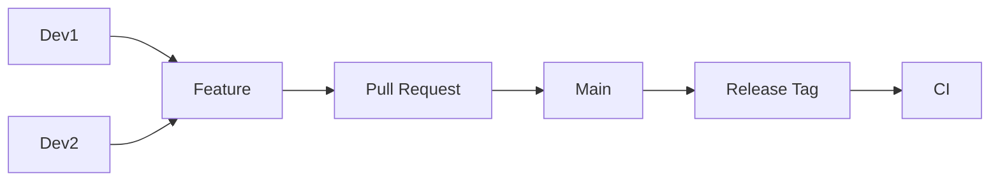

# Git

## 1. Overview

**What it is:** Distributed version control — the backbone of code review and CI triggers.

**When to use:** Always for code and IaC.

**When NOT to:** Store large binaries/secrets (use LFS/artifact stores; secret managers).

## 2. Concepts

- Commits, branches, remotes, tags
- Merge vs rebase; fast-forward
- Protected branches; CODEOWNERS
- Hooks (pre-commit) for lint/secrets
- Signed commits/tags (GPG/SSH)
- Bisect for regressions

## 3. Architecture



## 4. Production Best Practices

- Small PRs; meaningful messages (Conventional Commits)
- Protect main; required reviews + CI
- Tag releases; changelog automation
- Never force-push shared main; coordinate force-with-lease on personal branches only
- Pre-commit secret scanning

## 5. Common Mistakes

| Mistake | Fix |
|---------|-----|
| Commit `.env` | Rotate; purge history carefully (BFG/filter-repo) |
| Huge binary in git | Git LFS or artifact repo |
| Rewrite published history casually | Coordinate; prefer revert |

## 6. Debugging Guide

```bash
git status; git log --oneline --graph -20
git bisect start; git bisect bad; git bisect good <sha>
git reflog   # recover lost commits
```

## 7. Security

- Signed commits for release tags
- Branch protection; dismiss stale reviews
- Scan history for secrets on schedule

## 8. Performance

- Shallow clones in CI (`--depth`); sparse checkout monorepos
- Partial clone filters

## 9. Real Production Example

Trunk-based; short feature branches; squash merge; semver tags trigger release workflow; CODEOWNERS for `/infra`.

## 10. Interview Questions

**Beginner:** clone vs pull? merge vs rebase?

**Intermediate:** What is reflog? When reset --hard?

**Senior:** Recover from leaked secret in history. Monorepo branching strategy.

## 11. Checklist

- [ ] Branch protection
- [ ] Commit hygiene + hooks
- [ ] Tags for releases
- [ ] No secrets in history

## 12. Cheat Sheet

| Command | Purpose |
|---------|---------|
| `git switch -c feat/x` | New branch |
| `git rebase origin/main` | Update branch |
| `git revert <sha>` | Safe undo on main |
| `git tag -a v1.2.3` | Annotated tag |

### Branch protection (typical)

- Require PR reviews (1–2) + status checks
- Disallow force push to `main`
- Require linear history or allow squash merges deliberately
- Restrict who can push tags / create releases

### Revert vs reset

- **revert** — safe on shared branches; adds undoing commit
- **reset --hard** — only on local unpublished commits (or with team coordination)

## Related Skills

- [github-actions](../github-actions/SKILL.md)
- [cicd](../cicd/SKILL.md)
- [security](../security/SKILL.md)
