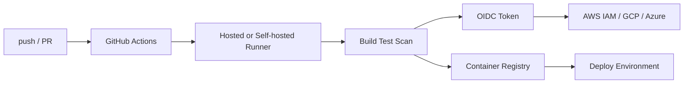

# GitHub Actions

## 1. Overview

**What it is:** GitHub-hosted CI/CD: YAML workflows in `.github/workflows/` run on events (push, PR, schedule, workflow_dispatch).

**Why it exists:** Integrate build/test/deploy with the same place code lives; reduce custom Jenkins maintenance for many teams.

**When to use:** GitHub-hosted repos needing CI/CD, matrix tests, OIDC to cloud.

**When NOT to use:** Air-gapped without GHES; extremely specialized agents better as self-hosted only platforms; org mandates another CI.

## 2. Concepts

- **Workflow** — YAML file; one or more jobs
- **Job** — runs on a **runner** (ubuntu-latest or self-hosted); steps sequential
- **Step** — `run:` shell or `uses:` action
- **Action** — reusable unit (JS/composite/Docker)
- **Matrix** — fan-out jobs (OS × version)
- **Artifacts** — files between jobs / for download
- **Caching** — restore keys for deps (`actions/cache`)
- **Reusable workflows** — `workflow_call`
- **Composite actions** — local multi-step actions
- **Environments** — protection rules, secrets, wait timers
- **OIDC** — short-lived cloud creds without static keys
- **Secrets / vars** — encrypted org/repo/env secrets

## 3. Architecture



## 4. Production Best Practices

- Pin actions by **commit SHA**, not floating major tags alone
- Least-privilege `permissions:` at workflow/job level (default read)
- Prefer **OIDC** over long-lived cloud keys
- Separate build and deploy jobs; deploy needs environment approvals
- Cache responsibly; don't cache secrets or huge unrelated paths
- Fail on HIGH/CRITICAL scanner findings with documented exceptions
- Concurrency groups to cancel outdated PR runs
- Self-hosted: ephemeral runners, isolated network, no privileged Docker socket sharing carelessly

## 5. Common Mistakes

| Mistake | Symptoms | Fix |
|---------|----------|-----|
| Over-broad `permissions: write-all` | Token abuse risk | Explicit minimal perms |
| Unpinned actions | Supply-chain surprise | SHA pin + Dependabot |
| Secrets in logs | Leak | Mask; never echo |
| No concurrency | Queued deploy races | `concurrency:` group |
| Fat cache keys | Stale deps | Include lockfile hash |
| Using pull_request_target unsafely | Secret theft from forks | Follow GitHub security guidance |

## 6. Debugging Guide

- Re-run failed jobs with **debug logging** (`ACTIONS_STEP_DEBUG` secret)
- Check runner labels, `runs-on`, and queue time
- Verify secrets exist in the **environment** scope used
- OIDC: inspect trust policy (`sub`, `aud`) mismatches in cloud IAM
- Matrix: identify which combination failed

```bash
# Locally approximate with act (optional) or run scripts from steps
yamllint .github/workflows/*.yml
```

## 7. Security

- OIDC federated roles; condition on `repo` and `ref`
- Environment required reviewers for production
- CODEOWNERS on workflow files
- Disable `workflow_dispatch` inputs that accept arbitrary commands
- Artifact retention limits; don't upload secrets
- For forks: careful with secrets (none on fork PRs by default)

## 8. Performance

- Split slow jobs; parallelize test shards
- Cache package managers; use remote build cache (BuildKit)
- Larger runners only where justified
- Avoid monolithic workflows; reusable workflows for shared CI

## 9. Real Production Example

Monorepo: path filters → affected packages; matrix Node 20/22; buildx push to GHCR; Trivy; Cosign; OIDC to AWS; deploy job `environment: production` with 2 reviewers; Slack notify on failure.

## 10. Interview Questions

**Beginner:** Job vs step? Where do secrets live?

**Intermediate:** OIDC vs access keys? Cache key design? Reusable vs composite?

**Senior:** Secure self-hosted fleet design. Prevent pwn-request. Multi-env promotion with approvals and provenance.

## 11. Checklist

- [ ] Minimal permissions; SHA-pinned actions
- [ ] OIDC for cloud; no static keys in secrets if avoidable
- [ ] Environment protection on prod
- [ ] Tests + SAST/SCA + image scan
- [ ] Concurrency + timeouts set
- [ ] Branch protection requires CI

## 12. Cheat Sheet

```yaml
permissions:
  contents: read
  id-token: write   # for OIDC
concurrency:
  group: deploy-${{ github.ref }}
  cancel-in-progress: true
```

```yaml
- uses: aws-actions/configure-aws-credentials@<sha>
  with:
    role-to-assume: arn:aws:iam::123:role/gha
    aws-region: us-east-1
```

See: [workflow-examples.md](workflow-examples.md)

## Related Skills

- [cicd](../cicd/SKILL.md)
- [docker](../docker/SKILL.md)
- [security](../security/SKILL.md)
- [aws](../aws/SKILL.md)
- [secrets-management](../secrets-management/SKILL.md)

---

**Author & maintainer:** Shanmukha Kumar Karra  
*Created and maintained as part of [AgentOps Kit](https://github.com/Shannuu2409/agentops-kit).*
