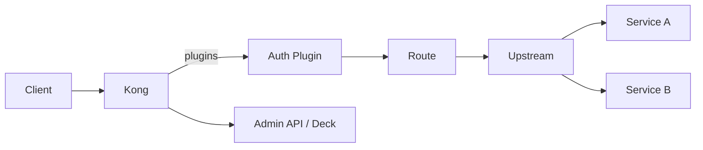

# Kong API Gateway

## 1. Overview

**What it is:** Kong is an API gateway (Nginx/OpenResty or Kong Gateway based) that centralizes auth, rate limits, transforms, and routing in front of services.

**When to use:** Many APIs needing consistent auth, quotas, WAF plugins, developer portal.

**When NOT to use:** Single internal service (Service mesh or Ingress enough); ultra-simple static sites (Nginx).

## 2. Concepts

- **Service** — upstream API abstraction
- **Route** — how requests match (host/path/method)
- **Consumer** — API client identity
- **Plugin** — auth (JWT/OIDC/key-auth), rate-limiting, CORS, request-transformer, ACL
- **Upstream / Target** — load balancing backends
- **DB-backed vs DB-less (declarative)** — Konnect/deck/`kong.yml`
- **Kong Ingress Controller / Gateway API** — Kubernetes integration

## 3. Architecture



## 4. Production Best Practices

- Declarative config in Git (`deck sync`); avoid click-ops Admin API in prod
- Separate Admin API (never public)
- Plugin order awareness (auth before business logic plugins)
- Timeouts and retries tuned per route; avoid retry storms
- Canary via traffic splitting / upstream weights
- Observe latency per route; enable OpenTelemetry plugin

## 5. Common Mistakes

| Mistake | Symptoms | Fix |
|---------|----------|-----|
| Public Admin API | Full compromise | Bind internal only + auth |
| Plugin mis-order | Auth bypass confusion | Document order; test |
| Wrong `strip_path` | 404 from upstream | Align route path |
| No consumer ACL | Cross-tenant API access | ACL + auth plugins |

## 6. Debugging Guide

```bash
deck gateway ping
curl -i https://gw.example.com/api/v1/health
# Check kong logs for upstream status
kubectl logs -n kong deploy/kong-gateway
```

Verify: route matched (host/path), plugin ran, upstream healthy targets.

## 7. Security

- mTLS or network policy to upstreams
- OIDC/JWT validation at edge
- Rate limit by consumer; bot detection
- RBAC on Kong Enterprise Admin
- Secrets for plugin credentials from Vault

## 8. Performance

- Scale data plane horizontally
- Keep plugins lean on hot paths
- Connection pooling to upstreams
- Avoid heavy Lua on every request without need

## 9. Real Production Example

Kong Ingress in EKS: JWT to Cognito; rate-limit tiers per plan; request transformer adds correlation ID; declarative deck in CI; Admin only via private link.

## 10. Interview Questions

**Beginner:** Service vs Route? What is a plugin?

**Intermediate:** DB-less vs DB mode? strip_path behavior?

**Senior:** Multi-cluster gateway HA. Compare Kong vs Envoy Gateway vs cloud API Gateway.

## 11. Checklist

- [ ] Admin API private
- [ ] Declarative config CI
- [ ] Auth + rate limit on public routes
- [ ] Health of upstream targets monitored
- [ ] TLS certificates valid

## 12. Cheat Sheet

```bash
deck file openapi2kong -s openapi.yaml -o kong.yaml
deck gateway sync kong.yaml
curl http://localhost:8001/services  # Admin — local only!
```

## Related Skills

- [nginx](../nginx/SKILL.md)
- [networking](../networking/SKILL.md)
- [security](../security/SKILL.md)
- [load-balancing](../load-balancing/SKILL.md)
- [service-mesh](../service-mesh/SKILL.md)
