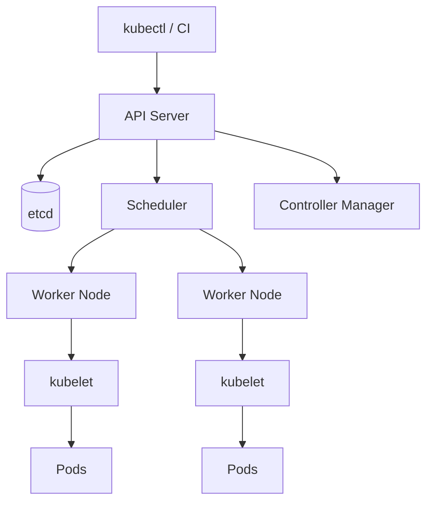
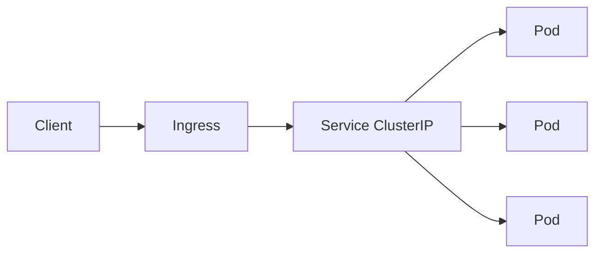

# Kubernetes

## 1. Overview

**What it is:** Kubernetes (K8s) is a container orchestrator that schedules containers across machines, keeps desired state, and provides service discovery, storage, and config APIs.

**Why it exists:** Running many containers by hand does not scale. K8s declares *desired state* (Deployments, Services) and continuously reconciles reality to match.

**Problems it solves:** Self-healing, rolling updates, horizontal scale, declarative config, multi-host networking, secrets/config injection.

**When to use:** Many services, need rolling deploys/autoscaling, platform teams standardizing runtimes.

**When NOT to use:** Single small app (Compose/ECS/App Runner may be simpler); team has no ops capacity for control plane/upgrades; hard real-time or GPU edge cases needing specialized schedulers only.

## 2. Concepts

### Control plane
- **API Server** — all requests (kubectl, controllers)
- **etcd** — cluster state store
- **Scheduler** — picks nodes for Pods
- **Controller Manager** — Deployment/ReplicaSet/Node controllers
- **Cloud Controller** — cloud LB/volumes (managed clouds)

### Worker node
- **kubelet** — runs Pods per API
- **kube-proxy** / CNI — Service networking
- **container runtime** — containerd/CRI-O

### Workloads
| Kind | Use |
|------|-----|
| **Pod** | Smallest unit; one or more containers sharing net/volumes |
| **ReplicaSet** | Maintains N Pod copies (usually via Deployment) |
| **Deployment** | Stateless rolling updates |
| **StatefulSet** | Stable identity + storage (DBs, Kafka) |
| **DaemonSet** | One Pod per node (agents, CNI) |
| **Job / CronJob** | Finite / scheduled batch |

### Services & traffic
- **ClusterIP** — internal VIP
- **NodePort / LoadBalancer** — external entry
- **Ingress / Gateway API** — L7 HTTP routing, TLS

### Config & storage
- **ConfigMap / Secret** — config and sensitive data (Secrets are base64, not encryption by default — enable encryption at rest)
- **PV / PVC / CSI** — persistent volumes via storage drivers

### Scheduling
**Requests/limits**, **taints/tolerations**, **node/pod affinity**, **topology spread**.

### Autoscaling
**HPA** (Pods by CPU/custom metrics), **VPA** (right-size requests), **Cluster Autoscaler / Karpenter** (nodes).

### Packaging
**Helm** (charts/releases), **Kustomize** (overlay patches), **Operators/CRDs** (domain controllers).

## 3. Architecture





## 4. Production Best Practices

- Declarative GitOps (Argo CD / Flux); no snowflake `kubectl apply` from laptops for prod
- Resource **requests always**; limits where appropriate; QoS awareness
- PodDisruptionBudgets for voluntary disruption (nodes drain)
- Probes: startup + readiness + liveness (don't abuse liveness)
- Separate namespaces by team/env; NetworkPolicies default-deny
- Images by digest; admission policies (Kyverno/OPA)
- Prefer Gateway API for new L7; Ingress still common
- etcd backups on self-managed; use managed control plane when possible (EKS/GKE/AKS)
- Limit cluster-admin; use IRSA/Workload Identity for cloud IAM

## 5. Common Mistakes

| Mistake | Symptoms | Fix | Prevention |
|---------|----------|-----|------------|
| No requests | Noisy neighbor, bad packing | Set requests/limits | LimitRange + policy |
| Liveness = heavy check | Restart loops | Lightweight liveness; readiness for deps | Probe guidelines |
| latest tags | Phantom deploys | Digests | Admission |
| Secrets as env in logs | Leakage | Mount files; external secrets | Secret scanning |
| One giant namespace | Blast radius | Split + RBAC | Platform standards |
| Ignoring PDB | Outages on drain | Add PDB | Cluster upgrade runbook |

## 6. Debugging Guide

```bash
kubectl get pods -A
kubectl describe pod <pod> -n <ns>     # Events are gold
kubectl logs <pod> -c <container> --previous
kubectl get events -n <ns> --sort-by=.lastTimestamp
kubectl top pod -n <ns>
kubectl get endpointslices -n <ns>
kubectl auth can-i list secrets -n <ns>
```

| Condition | Meaning | Next |
|-----------|---------|------|
| ImagePullBackOff | Pull/auth/tag | `describe`; check imagePullSecrets |
| CrashLoopBackOff | App exits | logs --previous; fix command/config |
| OOMKilled | Memory limit | Raise limit or fix leak |
| Pending | Scheduling | describe; resources/taints |
| NodeNotReady | Node/kubelet | node describe; CNI |

See [troubleshooting runbooks](../troubleshooting/SKILL.md).

## 7. Security

- **RBAC:** Role/ClusterRole + bindings; least privilege ServiceAccounts
- **NetworkPolicy / Cilium:** restrict east-west
- **Pod Security:** restricted PSS; no privileged
- **Secrets:** External Secrets Operator + Vault/AWS SM; encryption at rest
- **mTLS:** service mesh optional
- **Admission:** validate images, registries, capabilities
- **Audit logs:** API server audit to SIEM

## 8. Performance

- Right-size requests from metrics (VPA recommend mode first)
- HPA on golden signals, not only CPU
- Topology spread for HA; anti-affinity for replicas
- Avoid huge DaemonSets without requests
- Use Ready gates / startupProbe for slow apps
- etcd/API: watch cardinality; avoid huge Secrets/ConfigMaps (>1Mi caution)

## 9. Real Production Example

SaaS on EKS: Deployments + HPA; ALB Ingress Controller; ExternalDNS; cert-manager; EBS CSI for StatefulSets; IRSA for S3; Kyverno blocks `:latest`; Argo CD apps per env; PodDisruptionBudget `minAvailable: 2`; NetworkPolicy default deny + allow ingress from ingress-nginx namespace.

## 10. Interview Questions

**Beginner:** Pod vs Deployment? Service types? ConfigMap vs Secret?

**Intermediate:** Readiness vs liveness? How ClusterIP works (kube-proxy/IPVS)? PVC binding?

**Senior:** Design multi-tenant isolation. Debug 5xx after rolling update. Tradeoffs Helm vs Kustomize vs Operators. etcd restore story.

## 11. Checklist

- [ ] Requests/limits, probes, PDB
- [ ] Non-root, readOnlyRootFilesystem where possible
- [ ] NetworkPolicy, RBAC least privilege
- [ ] Image digest + scan
- [ ] HPA/PDB for critical services
- [ ] Backups for PVs / etcd strategy
- [ ] Runbook for CrashLoop/OOM/ImagePull
- [ ] GitOps path verified

## 12. Cheat Sheet

| Command | Purpose |
|---------|---------|
| `kubectl apply -f` | Declarative apply |
| `kubectl rollout status deploy/x` | Watch rollout |
| `kubectl rollout undo deploy/x` | Rollback |
| `kubectl scale deploy/x --replicas=3` | Scale |
| `kubectl exec -it pod -- sh` | Debug shell |
| `kubectl port-forward svc/x 8080:80` | Local tunnel |
| `helm upgrade --install` | Helm release |
| `kubectl kustomize ./overlays/prod \| kubectl apply -f -` | Kustomize |

See: [workloads-reference.md](workloads-reference.md)

## Related Skills

- [docker](../docker/SKILL.md)
- [networking](../networking/SKILL.md)
- [observability](../observability/SKILL.md)
- [security](../security/SKILL.md)
- [cicd](../cicd/SKILL.md)
- [troubleshooting](../troubleshooting/SKILL.md)
- [aws](../aws/SKILL.md)

---

**Author & maintainer:** Shanmukha Kumar Karra  
*Created and maintained as part of [AgentOps Kit](https://github.com/Shannuu2409/agentops-kit).*
