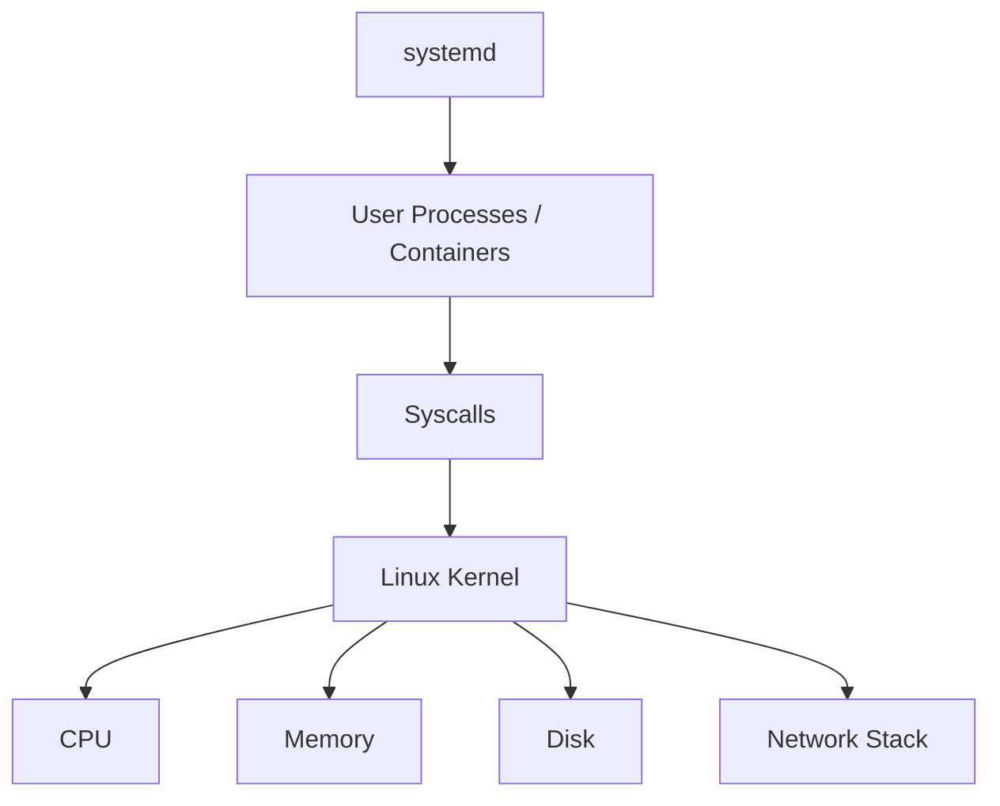

# Linux

## 1. Overview

**What it is:** The OS kernel + userland that runs almost all cloud VMs, containers' host, and CI runners.

**Why it matters for DevOps:** Containers and Kubernetes sit on Linux primitives (cgroups, namespaces, netfilter). Debugging production almost always ends at processes, disks, memory, and sysctl.

**When to use:** Always — host hardening, capacity, incident response.

**When NOT to treat as app platform:** Prefer containers/PaaS for apps; bare metal Linux for data planes, agents, and specialized workloads.

## 2. Concepts

### Filesystem
Everything is a file. Key paths: `/etc` (config), `/var/log` (logs), `/proc` (kernel/process API), `/sys` (devices/cgroups), `/tmp`.

### Processes & signals
PID, PPID, threads. Signals: `SIGTERM` (graceful), `SIGKILL` (forced), `SIGHUP` (reload often).

### systemd
Unit files manage services: `start/stop/restart/status`, journals via `journalctl`.

### Permissions
Owner/group/other + rwx; **umask**; **ACL** (`setfacl`) for finer grants; capabilities for privileged ops without full root.

### SSH
Key-based auth, `sshd_config`, bastions/SSM Session Manager preferred over open SSH to every node.

### Cron / timers
`cron` and `systemd.timer` for scheduled jobs — prefer idempotent jobs + locking.

### Security modules
**SELinux** / **AppArmor** — mandatory access control beyond DAC permissions.

## 3. Architecture



## 4. Production Best Practices

- Immutable / cattle hosts (golden images) over pet servers
- Centralize auth (SSO/IAM); disable password SSH
- Unattended security updates or bake patches into images
- chrony/NTP time sync (TLS and logs depend on it)
- Log to journal + ship off-box; never only local disk
- Monitor disk inodes and space; alert before 100%
- Separate OS disk vs data disks

## 5. Common Mistakes

| Mistake | Symptoms | Fix |
|---------|----------|-----|
| Full disk | Services fail writes | Clean logs; expand volume |
| Out of inodes | "No space" with free bytes | Find tiny-file dirs |
| Ignoring OOM killer | Random process death | `dmesg`; raise RAM/limits |
| World-writable scripts | Privilege abuse | Fix modes 750/640 |
| Disabling SELinux permanently | Audit gaps | Fix policies properly |

## 6. Debugging Guide

```bash
# CPU / load
uptime; top; pidstat 1
# Memory
free -h; vmstat 1; cat /proc/meminfo
# Disk
df -h; df -i; iostat -xz 1
# Process
ps auxf; systemctl status <svc>; journalctl -u <svc> -e
# Network
ss -lntp; ip route; ping; traceroute
# Kernel
dmesg -T | tail
```

## 7. Security

- Minimal packages; no compilers on prod if policy requires
- Firewall (nftables/UFW); only needed ports
- Fail2ban or cloud SG + WAF for SSH/HTTP
- Auditd for privileged actions
- Kernel hardening sysctls (rp_filter, kptr_restrict, etc.) carefully tested

## 8. Performance

- Understand load average vs CPU count
- Distinguish iowait vs CPU bound
- Tune `nofile` / `nproc` for high-connection services
- Use XFS/ext4 appropriately; mount options for DBs per vendor guidance

## 9. Real Production Example

Bastion-less: SSM Session Manager to EC2; CloudWatch agent; CIS-hardened AMI rebuilt weekly; systemd units for sidecars; journald → CloudWatch Logs; nftables default deny.

## 10. Interview Questions

**Beginner:** What does `chmod 640` mean? SIGTERM vs SIGKILL?

**Intermediate:** How does the OOM killer choose victims? systemd dependency types?

**Senior:** Debug intermittent latency (steal time, noisy neighbor, softirq). Design patch cadence for 10k nodes.

## 11. Checklist

- [ ] Time sync, disk alerts, SSH keys only
- [ ] Automatic patching strategy
- [ ] journald retention + shipping
- [ ] Firewall + minimal listeners (`ss -lntp`)
- [ ] SELinux/AppArmor enforcing where required

## 12. Cheat Sheet

| Command | Purpose |
|---------|---------|
| `systemctl restart x` | Restart service |
| `journalctl -fu x` | Follow unit logs |
| `ss -lntp` | Listening ports |
| `lsof -i :443` | Who uses port |
| `chmod` / `chown` / `getfacl` | Permissions |

See also: [hardening-checklist.md](hardening-checklist.md)

## Related Skills

- [networking](../networking/SKILL.md)
- [security](../security/SKILL.md)
- [performance](../performance/SKILL.md)
- [troubleshooting](../troubleshooting/SKILL.md)
- [scripting](../scripting/SKILL.md)
