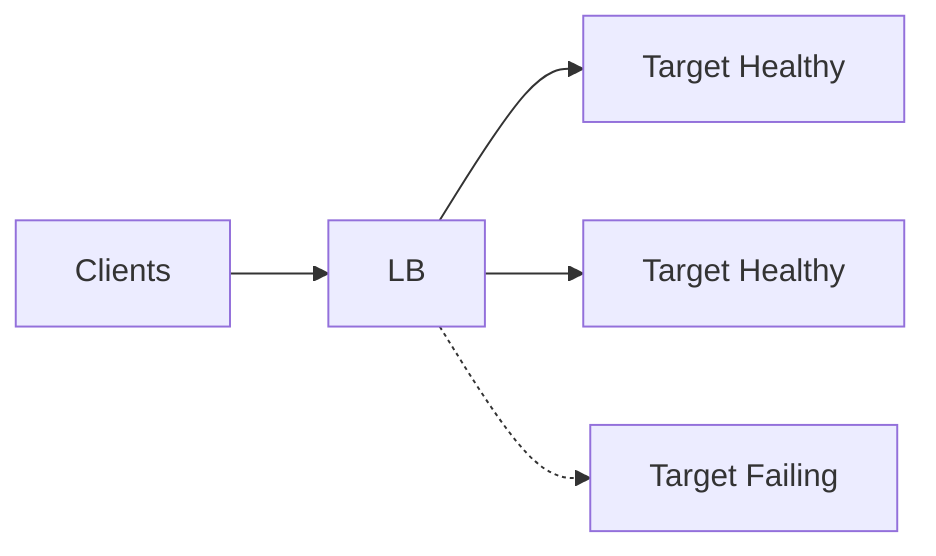

# Load Balancing

## 1. Overview

**What it is:** Distributing traffic across healthy backends for scale and availability.

**When to use:** More than one replica; blue-green/canary traffic control.

**When NOT to:** Single instance without HA needs — still often put LB for future + certs.

## 2. Concepts

- **L4** — TCP/UDP (NLB, HAProxy TCP mode)
- **L7** — HTTP features (ALB, Nginx, Envoy)
- **Algorithms** — round-robin, least-conn, IP hash, weighted, Maglev
- **Health checks** — active probes; remove bad targets
- **Sticky sessions** — affinity (use carefully)
- **Connection draining / deregistration delay**
- **Cross-zone balancing**

## 3. Architecture



## 4. Production Best Practices

- Health check = readiness, not only process up
- Align timeouts client → LB → app
- Drain before deploy
- Prefer stateless apps over stickiness
- Multi-AZ targets
- Observe request count per target for imbalance

## 5. Common Mistakes

| Mistake | Symptoms | Fix |
|---------|----------|-----|
| Health on `/` heavy page | Flapping | Lightweight `/healthz` |
| Idle timeout < app long poll | 502/504 | Raise LB idle |
| Stickiness + bad node | User pain | Fix state store |
| No cross-zone | Hot AZ | Enable cross-zone |

## 6. Debugging Guide

```bash
aws elbv2 describe-target-health --target-group-arn ...
# Look at 5xx from LB vs target
curl -I https://service/healthz
```

Imbalance: slow targets get fewer least-conn; hash affinity skew; AZ uneven capacity.

## 7. Security

- SG: LB public, targets only from LB SG
- WAF on L7 public LBs
- TLS on listener; backend TLS optional/private

## 8. Performance

- Keep-alive to targets
- Right-size idle timeouts for websockets
- NLB for extreme L4 PPS; ALB for HTTP routing

## 9. Real Production Example

ALB path-based routing to target groups; slow-start for new ASG instances; deregistration 60s; WAF associated; access logs to S3.

## 10. Interview Questions

**Beginner:** Why health checks?

**Intermediate:** L4 vs L7 tradeoffs?

**Senior:** Global load balancing + regional failover design.

## 11. Checklist

- [ ] Health checks = ready
- [ ] Timeouts documented
- [ ] Draining enabled
- [ ] Multi-AZ
- [ ] Access/error logs on

## 12. Cheat Sheet

| LB | Layer | Typical use |
|----|-------|-------------|
| NLB | L4 | Ultra performance, static IP |
| ALB | L7 | HTTP routing, WAF |
| Nginx/HAProxy | L4/L7 | Self-managed |

## Related Skills

- [networking](../networking/SKILL.md)
- [nginx](../nginx/SKILL.md)
- [blue-green-deployment](../blue-green-deployment/SKILL.md)
- [aws](../aws/SKILL.md)
- [troubleshooting](../troubleshooting/SKILL.md)
