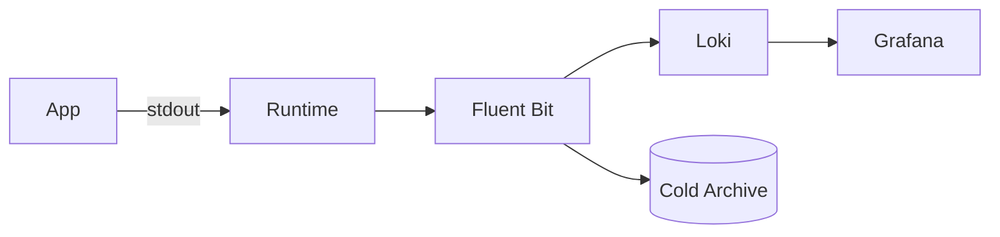

# Logging

## 1. Overview

**What it is:** Capturing application and system events for debugging, audit, and security.

**When to use:** Always — stdout in containers; centralized aggregation in prod.

**When NOT to:** Logging secrets/PII; unbounded debug in hot paths without sampling.

## 2. Concepts

- **Structured logs** (JSON) > free text
- **Correlation IDs** / trace_id fields
- **Levels** — DEBUG/INFO/WARN/ERROR
- **Shippers** — Fluent Bit, Vector, Filebeat
- **Backends** — Loki, Elasticsearch/OpenSearch, CloudWatch, Splunk
- **Retention & tiering** — hot/warm/cold

## 3. Architecture



## 4. Production Best Practices

- Log to stdout/stderr in containers
- JSON with consistent field names
- Sampling or dynamic levels under load
- PII redaction at source or shipper
- Retention meets compliance; cheaper cold storage

## 5. Common Mistakes

| Mistake | Symptoms | Fix |
|---------|----------|-----|
| Unstructured logs | Hard queries | JSON schema |
| Logging bodies with secrets | Breach | Redact |
| Infinite DEBUG | Cost spike | Level gates |
| No correlation id | Can't stitch requests | Middleware |

## 6. Debugging Guide

Query by `trace_id`, `status`, `path`. Compare before/after deploy timestamps. Check shipper backlog metrics.

## 7. Security

- Encrypt in transit; restrict index access RBAC
- Immutable audit logs where required
- Separate security audit stream

## 8. Performance

- Async logging; avoid sync disk in request path
- Batch ship; compress
- Drop debug from high-QPS endpoints

## 9. Real Production Example

Apps → stdout → Fluent Bit DaemonSet → Loki + S3 backup; Grafana Explore; PII fields hashed; 30d hot / 1y cold.

## 10. Interview Questions

**Beginner:** Why JSON logs? stdout vs files?

**Intermediate:** Cardinality in Loki labels?

**Senior:** Multi-tenant log isolation + cost controls.

## 11. Checklist

- [ ] Structured + correlation IDs
- [ ] Central shipping + alerts on backlog
- [ ] Retention policy documented
- [ ] PII policy enforced

## 12. Cheat Sheet

```bash
kubectl logs -l app=api --tail=100 -f
# Loki LogQL example
{app="api"} |= "error" | json | status >= 500
```

### Log levels in practice

| Level | When |
|-------|------|
| ERROR | Failures needing action |
| WARN | Degraded / retryable |
| INFO | Business-significant events |
| DEBUG | Detailed diagnostics (off by default in prod) |

### Label vs field (Loki/ELK)

**Labels/indexes** should be low-cardinality (`app`, `env`, `level`). High-cardinality values (`user_id`, `request_id`) belong in **log fields** you filter after a stream select — otherwise index cost explodes.

## Related Skills

- [observability](../observability/SKILL.md)
- [monitoring](../monitoring/SKILL.md)
- [security](../security/SKILL.md)
- [troubleshooting](../troubleshooting/SKILL.md)
