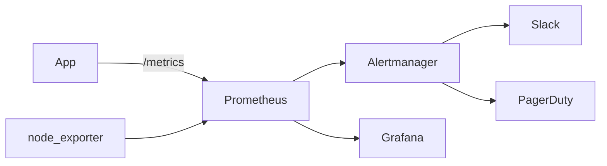

# Monitoring

## 1. Overview

**What it is:** Collecting **metrics** over time, visualizing them, and alerting when service level is at risk.

**When to use:** Always in production — you cannot operate what you cannot see.

**When NOT to:** Alerting on every raw metric without SLOs (noise). Metrics alone without logs/traces for deep debug — see [observability](../observability/SKILL.md).

## 2. Concepts

- **Prometheus** — pull-based TSDB + PromQL
- **Exporters** — node_exporter, blackbox, redis_exporter
- **Grafana** — dashboards
- **Alertmanager** — route/group/silence alerts
- **USE / RED / golden signals** — utilization, errors, latency, traffic, saturation
- **SLO / SLI / error budget** — alert on user impact, not CPU alone

## 3. Architecture



## 4. Production Best Practices

- Alert on symptoms (SLO burn) > causes (CPU)
- Label carefully; high cardinality kills Prometheus
- Recording rules for expensive queries
- HA Prometheus or managed (AMP, Grafana Cloud)
- Runbooks linked in every alert annotation

## 5. Common Mistakes

| Mistake | Symptoms | Fix |
|---------|----------|-----|
| User_id labels | OOM Prometheus | Drop high-card labels |
| Alert spam | Pages ignored | SLO + grouping |
| No runbook | Slow MTTR | Link docs |
| Only average latency | Hide tail | Histogram p99 |

## 6. Debugging Guide

```promql
rate(http_requests_total{status=~"5.."}[5m])
histogram_quantile(0.99, sum by (le) (rate(http_request_duration_seconds_bucket[5m])))
```

Check target scrape health in Prometheus UI; Alertmanager silences.

## 7. Security

- Authn/z on Grafana; no anonymous admin
- Network-isolate Prometheus; sensitive metrics scrubbed
- Alert channels in secured workspaces

## 8. Performance

- Appropriate scrape intervals; federation/sharding
- Remote write carefully; downsample long-term

## 9. Real Production Example

Kube-prometheus-stack; Grafana foldering by team; multi-window multi-burn SLO alerts; Alertmanager routes sev1 to PagerDuty, sev2 Slack.

## 10. Interview Questions

**Beginner:** Metric types? What is scrape?

**Intermediate:** Write a PromQL rate query. Histogram vs summary?

**Senior:** Global view across 50 clusters. Cardinality governance.

## 11. Checklist

- [ ] Golden signals per critical service
- [ ] SLO alerts with runbooks
- [ ] Grafana access controlled
- [ ] Disk/retention for Prometheus sized
- [ ] Silence hygiene

## 12. Cheat Sheet

| Item | Notes |
|------|-------|
| Counter | Use `rate()` |
| Gauge | Point-in-time |
| Histogram | Latency buckets |

### Multi-window multi-burn alerts (concept)

Alert when error budget is burning too fast over a short window **and** sustained over a longer window. This catches both sharp outages and slow leaks without paging on tiny blips.

### Cardinality governance

Budget series per service; reject metrics with unbounded labels at the collector; periodic top-offenders report from Prometheus TSDB status.

## Related Skills

- [observability](../observability/SKILL.md)
- [logging](../logging/SKILL.md)
- [performance](../performance/SKILL.md)
- [troubleshooting](../troubleshooting/SKILL.md)

---

**Author & maintainer:** Shanmukha Kumar Karra  
*Created and maintained as part of [AgentOps Kit](https://github.com/Shannuu2409/agentops-kit).*
