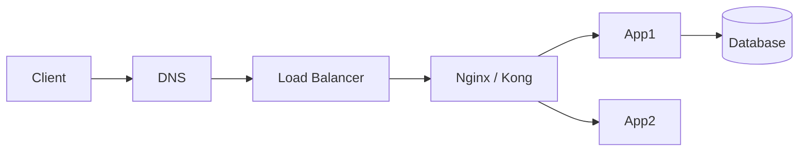
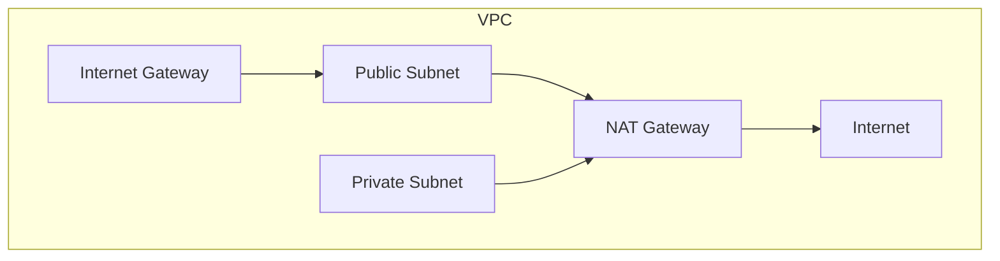

# Networking

## 1. Overview

**What it is:** How packets move between processes across hosts — addressing, routing, transport, and application protocols.

**Why it exists:** Distributed systems are networking problems first. Most "app bugs" in prod are DNS, TLS, timeouts, or MTU.

**When to use:** VPC design, Service mesh prep, LB/proxy config, incident connectivity checks.

**When NOT to over-engineer:** Don't invent custom protocols when HTTPS + gRPC suffice.

## 2. Concepts

### OSI vs TCP/IP (practical)
L3 IP routing → L4 TCP/UDP ports → L7 HTTP/gRPC. Engineers debug bottom-up or top-down with `ping`/`ss`/`curl`/`dig`.

### TCP
3-way handshake, congestion control, retransmission. Timeouts and half-open connections matter under LBs.

### HTTP / HTTPS
Methods, status codes, headers, keep-alive. HTTPS = HTTP over **TLS**.

### DNS
Recursive resolvers, authoritative NS, A/AAAA/CNAME/MX/TXT, TTLs, caching pitfalls.

### TLS
Handshake, certificates, SNI, cipher suites. See [ssl](../ssl/SKILL.md).

### NAT / VPN / CIDR
Private ranges, SNAT/DNAT, site-to-site VPN, subnet math (`/16` vs `/24`).

### Load balancing & proxies
L4 (NLB/HAProxy TCP) vs L7 (ALB/Nginx/Kong). Reverse proxy terminates client connections.

### Firewalls
iptables (legacy), **nftables**, UFW (Ubuntu frontend), cloud security groups + NACLs.

## 3. Architecture





## 4. Production Best Practices

- Private workloads in private subnets; egress via NAT or controlled proxies
- Health checks aligned with app readiness
- Timeouts: client < idle LB < upstream — document the chain
- Prefer TLS everywhere; short-lived certs (ACME)
- DNS TTLs: balance failover speed vs lookup volume
- Explicit allow-lists over broad 0.0.0.0/0 where possible

## 5. Common Mistakes

| Mistake | Symptoms | Fix |
|---------|----------|-----|
| Wrong security group | Timeouts | Open path SG→SG |
| DNS TTL too high | Slow failover | Lower TTL before change |
| MTU/VPN blackhole | Hangs large packets | Clamp MSS / fix MTU |
| Hairpin NAT issues | Local clients fail | Split DNS / internal LB |
| Ignoring ephemeral ports | Outbound exhaustion | Tune port range / conntrack |

## 6. Debugging Guide

```bash
dig +short api.example.com
curl -vI https://api.example.com
ss -lntp
traceroute target
tcpdump -ni eth0 host x.x.x.x
# conntrack
conntrack -L | wc -l
```

Expected: DNS resolves to expected VIP; TCP connect succeeds; TLS cert matches SNI; HTTP status expected.

## 7. Security

- Segment networks (public/DMZ/private/data)
- mTLS for service-to-service when threat model requires
- WAF in front of public HTTP
- Disable unused protocols/ciphers
- Egress control to reduce exfil

## 8. Performance

- Keep-alive and connection pooling
- HTTP/2 or HTTP/3 where beneficial
- Regional locality; avoid cross-AZ chatter when costly
- Right-size LB idle timeouts for websockets/gRPC streams

## 9. Real Production Example

Multi-AZ VPC: public ALB → private Nginx Ingress → ClusterIP Services; Route53 latency policy; NACLs default; SG least privilege; VPC Flow Logs → SIEM.

## 10. Interview Questions

**Beginner:** TCP vs UDP? What is a subnet?

**Intermediate:** Explain SYN flood mitigation. CNAMEs at zone apex?

**Senior:** Design zero-downtime DNS cutover. Debug asymmetric routing. East-west encryption strategy.

## 11. Checklist

- [ ] CIDR plan documented; no overlapping peered ranges
- [ ] SG/NACL reviewed
- [ ] DNS + TLS verified
- [ ] Timeouts documented end-to-end
- [ ] Flow logs / firewall logging enabled

## 12. Cheat Sheet

| Tool | Use |
|------|-----|
| `dig` / `nslookup` | DNS |
| `curl -v` | HTTP/TLS |
| `ss` / `lsof` | Sockets |
| `tcpdump` / `wireshark` | Packets |
| `nft` / `iptables` | Firewall |

## Related Skills

- [dns](../dns/SKILL.md)
- [ssl](../ssl/SKILL.md)
- [load-balancing](../load-balancing/SKILL.md)
- [nginx](../nginx/SKILL.md)
- [kong](../kong/SKILL.md)
- [linux](../linux/SKILL.md)
- [troubleshooting](../troubleshooting/SKILL.md)
