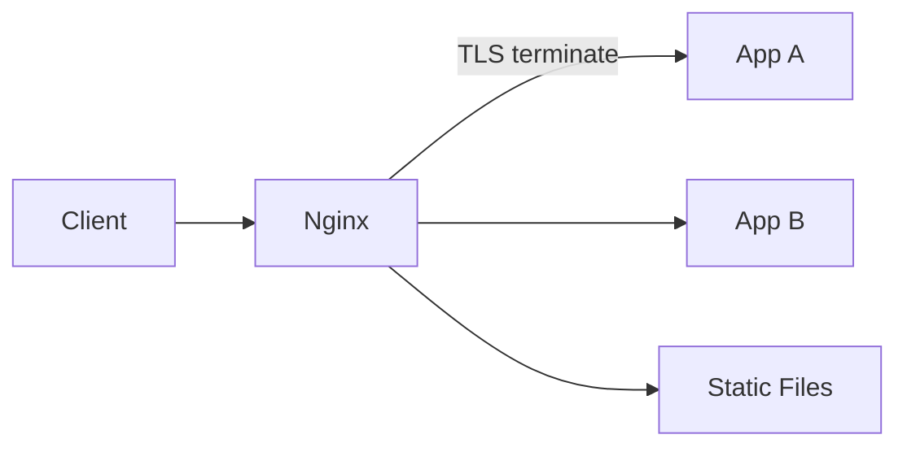

# Nginx

## 1. Overview

**What it is:** High-performance HTTP server and reverse proxy, widely used for TLS termination, static assets, and L7 load balancing.

**When to use:** Edge proxy, Kubernetes Ingress controller, static SPA hosting, simple API gateway patterns.

**When NOT to use:** Complex API management (use Kong/Apigee); L4 ultra-scale (NLB/HAProxy TCP); need dynamic DB-backed routing (API gateway).

## 2. Concepts

- **worker processes** — event-driven; one per CPU typically
- **server blocks** — virtual hosts by `server_name`
- **location** — path matching (`=`, prefix, regex)
- **upstream** — backend pool + load method
- **proxy_pass** — reverse proxy (trailing slash matters!)
- **ssl_certificate** — TLS termination
- **gzip/brotli**, **cache**, **rate limit** zones
- **stream{}** — TCP/UDP proxy (non-HTTP)

## 3. Architecture



## 4. Production Best Practices

- Config in Git; `nginx -t` before reload
- Prefer `systemctl reload` over restart (zero-downtime)
- Strong TLS (1.2+/1.3); HSTS when ready
- Timeouts explicit: `proxy_connect/send/read_timeout`
- Buffer sizes tuned for headers/cookies
- Access + error logs shipped; JSON logs if possible
- Hide version (`server_tokens off`)

## 5. Common Mistakes

| Mistake | Symptoms | Fix |
|---------|----------|-----|
| Trailing slash `proxy_pass` misuse | Wrong upstream path | Read nginx proxy_pass rules |
| Small `proxy_buffers` | 502 on large headers | Raise buffers |
| No upstream keepalive | Latency/conn churn | `keepalive` in upstream |
| Reload with bad config | Outage if restart used | Always `nginx -t` |

## 6. Debugging Guide

```bash
nginx -t
nginx -T | less          # dump full config
tail -f /var/log/nginx/error.log
curl -I https://localhost -H 'Host: app.example.com'
```

**502** — upstream down/refused; **504** — upstream timeout; **413** — body too large (`client_max_body_size`).

## 7. Security

- TLS only public listeners; redirect HTTP→HTTPS
- Limit methods; WAF (ModSecurity) if required
- `limit_req` / `limit_conn` against abuse
- Do not pass unchecked headers that enable hop abuse
- Separate trusted internal upstream network

## 8. Performance

- `open_file_cache`; sendfile; gzip for text
- HTTP/2; connection keepalive to upstreams
- Cache immutable static assets aggressively
- Tune `worker_connections` with ulimit

## 9. Real Production Example

Edge Nginx: ACME certs via certbot/cert-manager; upstream to K8s NodePort/Ingress; rate limit login locations; mTLS to internal API optional; blue-green via upstream upstream file swap + reload.

## 10. Interview Questions

**Beginner:** What is reverse proxy? server vs location?

**Intermediate:** Exact vs prefix location priority? Why 502?

**Senior:** Design zero-downtime config reload at scale. Compare Nginx vs Envoy as ingress.

## 11. Checklist

- [ ] `nginx -t` in CI
- [ ] TLS + redirects
- [ ] Timeouts/buffers set
- [ ] Rate limits on auth endpoints
- [ ] Log shipping + alerts on 5xx rate

## 12. Cheat Sheet

```nginx
upstream api {
  server 10.0.1.10:8080;
  keepalive 32;
}
server {
  listen 443 ssl http2;
  server_name api.example.com;
  location / {
    proxy_http_version 1.1;
    proxy_set_header Connection "";
    proxy_set_header Host $host;
    proxy_set_header X-Forwarded-For $proxy_add_x_forwarded_for;
    proxy_pass http://api;
  }
}
```

## Related Skills

- [load-balancing](../load-balancing/SKILL.md)
- [ssl](../ssl/SKILL.md)
- [networking](../networking/SKILL.md)
- [kong](../kong/SKILL.md)
- [troubleshooting](../troubleshooting/SKILL.md)

---

**Author & maintainer:** Shanmukha Kumar Karra  
*Created and maintained as part of [AgentOps Kit](https://github.com/Shannuu2409/agentops-kit).*
