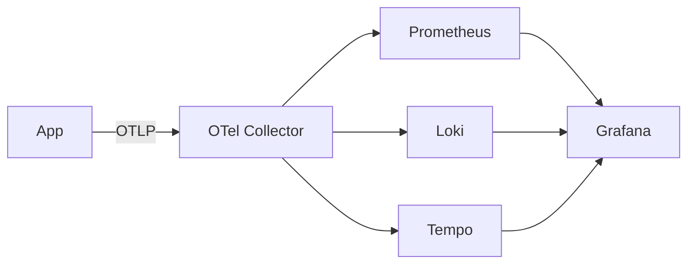

# Observability

## 1. Overview

**What it is:** Ability to understand system behavior from external outputs — **metrics, logs, and traces** (and increasingly continuous profiles).

**Why it exists:** Microservices fail in partial, emergent ways; guessing without telemetry wastes incident time.

**When to use:** Distributed systems, SLOs, performance debugging.

**When NOT to:** Instrument everything at maximum cardinality on day one — start with golden signals + critical paths.

## 2. Concepts

- **Metrics** — aggregatable numerics (Prometheus)
- **Logs** — discrete events (Loki/ELK)
- **Traces** — request journeys across services (Tempo/Jaeger/Zipkin)
- **OpenTelemetry (OTel)** — vendor-neutral APIs/SDKs/collectors
- **Context propagation** — W3C traceparent headers
- **Exemplars** — link metrics ↔ traces
- **Continuous profiling** — CPU/mem flame graphs (Pyroscope/Parca)

## 3. Architecture

## 4. Production Best Practices

- Standard attributes (service.name, env, version)
- Trace sample thoughtfully (head/tail sampling)
- Correlate: same `trace_id` in logs
- RED metrics per service + SLO dashboards
- Collector as gateway (auth, batching, scrubbing)
- Avoid high-cardinality labels (user_id)

## 5. Common Mistakes

| Mistake | Impact | Fix |
|---------|--------|-----|
| No propagation | Broken traces | OTel middleware |
| 100% trace prod | Cost/latency | Sampling |
| Metrics as logs | Cost explosion | Proper metrics |
| Tool sprawl | Cognitive load | Single pane Grafana |

## 6. Debugging Guide

1. Symptom alert → service dashboard
2. Spike → related traces with error spans
3. Span → logs via trace_id
4. Hot span → profile if CPU-bound

## 7. Security

- Scrub PII from spans/logs in collector
- Restrict who can query prod telemetry
- Encrypt OTLP pipelines

## 8. Performance

- Batch export; async processors
- Tail sampling on errors/latency
- Resource detectors once at start

## 9. Real Production Example

OTel SDK in services → Collector DaemonSet + gateway → AMP + Loki + Tempo; Grafana; SLO burn alerts include Explore links.

## 10. Interview Questions

**Beginner:** Metrics vs logs vs traces?

**Intermediate:** What is context propagation?

**Senior:** Tail sampling design. Multi-tenant observability cost control.

## 11. Checklist

- [ ] OTel (or equiv) on critical services
- [ ] Trace-log correlation
- [ ] Golden signal dashboards
- [ ] PII scrubbing
- [ ] Sampling policy documented

## 12. Cheat Sheet

| Signal | Ask |
|--------|-----|
| Metrics | Is it broken / how bad? |
| Traces | Where in the path? |
| Logs | What exactly happened? |
| Profiles | Why is code slow? |

## Related Skills

- [monitoring](../monitoring/SKILL.md)
- [logging](../logging/SKILL.md)
- [performance](../performance/SKILL.md)
- [troubleshooting](../troubleshooting/SKILL.md)

---

**Author & maintainer:** Shanmukha Kumar Karra  
*Created and maintained as part of [AgentOps Kit](https://github.com/Shannuu2409/agentops-kit).*
