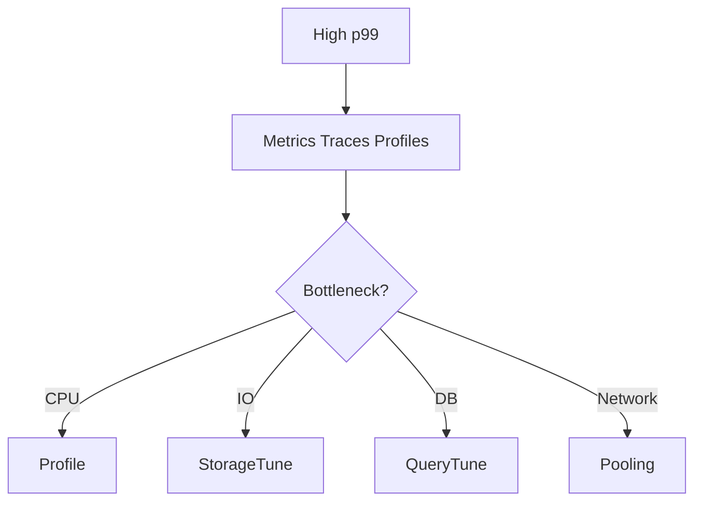

# Performance

## 1. Overview

**What it is:** Delivering acceptable **latency** and **throughput** under load within cost constraints.

**Golden rule:** Measure before optimizing; optimize the bottleneck.

**When to use:** SLO latency burn, capacity planning, cost reduction via efficiency.

**When NOT to:** Premature micro-optimization without profiles/metrics.

## 2. Concepts

- **Latency vs throughput vs saturation**
- **Percentiles** — p50/p95/p99 matter more than averages
- **Amdahl's law** — sequential limits speedup
- **Caching** — hit ratio, invalidation, stampedes
- **Backpressure / load shedding**
- **Connection pooling**
- **N+1 queries**, lock contention
- **cgroups limits** causing throttling

## 3. Architecture



## 4. Production Best Practices

- SLOs with percentile objectives
- Load test realistic scenarios (k6/Locust) before big launches
- Cache with TTLs + jitter; avoid thundering herd
- Autoscale on saturation/lag not only CPU
- Capacity headroom for AZ loss (N-1)
- Continuous profiling in prod with privacy controls

## 5. Common Mistakes

| Mistake | Fix |
|---------|-----|
| Tune without evidence | Profile + traces |
| Cache without invalidation plan | Design TTL/events |
| Scale pods on CPU only | Use golden signals |
| Ignore GC / cold start | Warm pools; tune GC |

## 6. Debugging Guide

```bash
# Linux
perf top; pidstat 1; iostat -xz 1
# App
# Use language profilers / py-spy / pprof
# K8s
kubectl top pod; check throttling cpu
```

Look for: queue depth, DB locks, thread pool exhaustion, DNS latency, TLS handshake storms.

## 7. Security

- Load tests against staging with auth
- Don't DDoS yourself in prod without approval
- Profiles may contain sensitive stacks — control access

## 8. Performance (techniques)

- Batch writes; async where safe
- CDN for static; HTTP caching headers
- Pagination; avoid unbounded queries
- Compression tradeoffs CPU vs bandwidth
- Regional locality

## 9. Real Production Example

p99 checkout SLO; trace shows DB; EXPLAIN adds index; k6 verifies; HPA on concurrent requests; cache product catalog in Redis with pub/sub invalidation.

## 10. Interview Questions

**Beginner:** Latency vs throughput?

**Intermediate:** Why p99 not average?

**Senior:** Design for thundering herd on cache expiry. Multi-tenant fairness.

## 11. Checklist

- [ ] Baseline metrics + profiles
- [ ] Bottleneck identified
- [ ] Load test validates fix
- [ ] Autoscale/headroom reviewed
- [ ] Regression dashboard

## 12. Cheat Sheet

| Area | Tools |
|------|-------|
| Load test | k6, Locust, vegeta |
| Profile | pprof, perf, async-profiler |
| DB | EXPLAIN, pg_stat_statements |
| Net | ss, tcpdump, eBPF |

## Related Skills

- [observability](../observability/SKILL.md)
- [monitoring](../monitoring/SKILL.md)
- [linux](../linux/SKILL.md)
- [databases](../databases/SKILL.md)
- [troubleshooting](../troubleshooting/SKILL.md)

---

**Author & maintainer:** Shanmukha Kumar Karra  
*Created and maintained as part of [AgentOps Kit](https://github.com/Shannuu2409/agentops-kit).*
