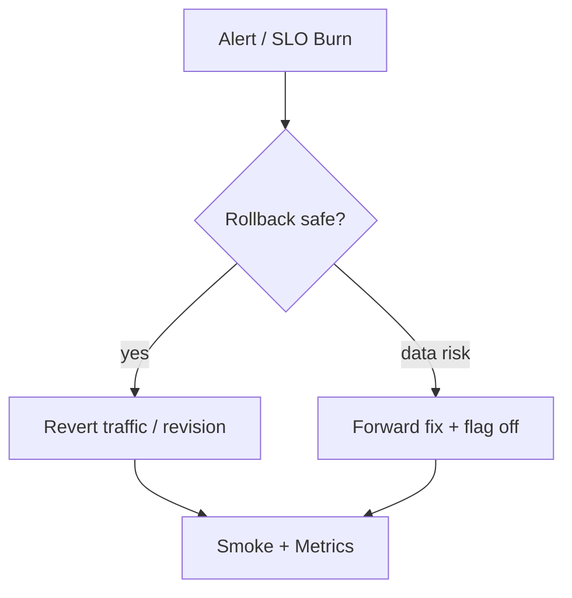

# Rollback Strategies

## 1. Overview

**What it is:** Returning service to a last-known-good state quickly when a release misbehaves.

**Why it exists:** Failures will ship; MTTR depends on practiced rollback.

**When to use:** Error budget burn, SEV incidents, failed canary analysis.

**When NOT to:** Blind rollback when **data migration already wrote irreversible incompatible data** — may need forward-fix instead.

## 2. Concepts

- **Artifact rollback** — redeploy previous image digest
- **Traffic rollback** — point LB to blue / previous weight
- **Config rollback** — Git revert of ConfigMap/feature flags
- **Feature flag kill switch** — disable code path without redeploy
- **Forward fix** — ship hotfix when rollback unsafe
- **DB considerations** — never rely on down-migrations in panic without rehearsal

## 3. Architecture



## 4. Production Best Practices

- One-click / automated rollback in CD tool
- Always know previous digest (not just `:prev` tag)
- Practice game days
- Prefer flags for risky features
- Define **abort criteria** before deploy
- Keep N previous revisions available

## 5. Common Mistakes

| Mistake | Symptoms | Fix |
|---------|----------|-----|
| No previous artifact | Can't roll back | Registry retention |
| Rollback incompatible schema | Worse outage | Expand-contract |
| Rollback without cache purge | Users see mix | CDN/purge plan |
| Debating too long | SLO burn | Pre-agreed criteria |

## 6. Debugging Guide

```bash
kubectl rollout history deploy/api
kubectl rollout undo deploy/api --to-revision=3
helm rollback myapp 12
# Confirm digest
kubectl get pod -o jsonpath='{.items[0].status.containerStatuses[0].imageID}'
```

Verify: error rate down, saturation OK, no DB lock storms.

## 7. Security

- Restrict who can rollback prod
- Audit rollback events
- Don't roll back to known-vulnerable digests without risk acceptance

## 8. Performance

- Fast paths: traffic switch > rebuilding
- Pre-pulled previous images on nodes

## 9. Real Production Example

Canary abort restores stable Service selector; if 100% already cut over, Argo CD re-syncs previous Git commit; flag disables new checkout path in <1 min while investigating.

## 10. Interview Questions

**Beginner:** What is a rollback?

**Intermediate:** When is forward-fix better?

**Senior:** Rollback strategy for stateful dual-write systems.

## 11. Checklist

- [ ] Previous digests retained
- [ ] Automated/runbook rollback path
- [ ] Criteria documented
- [ ] DB compatibility verified
- [ ] Post-rollback comms template

## 12. Cheat Sheet

| Strategy | Speed | Risk |
|----------|-------|------|
| Flag off | Fastest | Code still present |
| Traffic revert | Fast | Needs dual stack |
| Redeploy prev | Fast | Schema must allow |
| Forward fix | Variable | Needed if data moved |

## Related Skills

- [blue-green-deployment](../blue-green-deployment/SKILL.md)
- [canary-deployment](../canary-deployment/SKILL.md)
- [cicd](../cicd/SKILL.md)
- [disaster-recovery](../disaster-recovery/SKILL.md)

---

**Author & maintainer:** Shanmukha Kumar Karra  
*Created and maintained as part of [AgentOps Kit](https://github.com/Shannuu2409/agentops-kit).*
