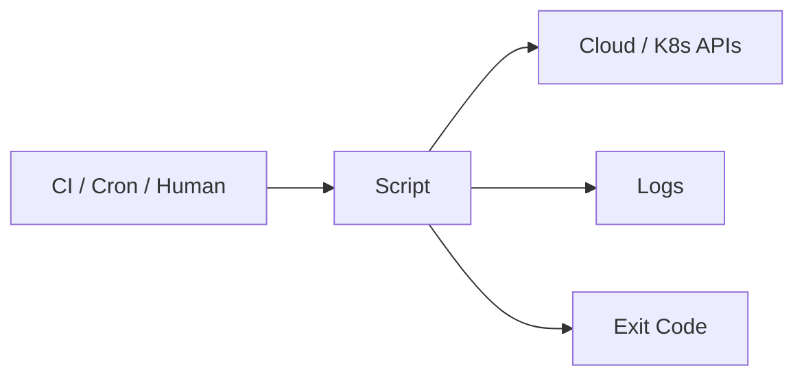

# Scripting

## 1. Overview

**What it is:** Automating operational tasks with Bash, Python, Go, etc.

**When to use:** Glue between tools; one-off safe automation; CI steps.

**When NOT to:** Replacing real applications; untested scripts that mutate prod without dry-run.

## 2. Concepts

- **Idempotency** — safe re-run
- **Exit codes** — 0 success
- **set -euo pipefail** (Bash discipline)
- **Quoting** — prevent word-splitting
- **Dry-run flags**
- **Structured logging**
- **Secrets via env/store — never argv if avoidable**
- **Python click/typer** for CLIs

## 3. Architecture



## 4. Production Best Practices

- ShellCheck + `set -euo pipefail`
- Prefer Python for complex logic
- `--dry-run` for destructive ops
- Explicit timeouts on network calls
- Version scripts in git; code review
- Minimal output of secrets

## 5. Common Mistakes

| Mistake | Fix |
|---------|-----|
| Unquoted `$var` | Always quote |
| Ignoring exit codes in pipes | `pipefail` |
| `curl` without `-f` | Fail on HTTP errors |
| Parsing `kubectl` plain text | `-o json` + jq |

## 6. Debugging Guide

```bash
bash -x ./script.sh
shellcheck ./script.sh
python -m pdb tool.py
```

## 7. Security

- Don't pass secrets on command line (visible in `ps`)
- Validate inputs; never `eval` user input
- Least privilege credentials for script roles

## 8. Performance

- Avoid O(n) API calls in loops — batch
- Parallelism with care (`xargs -P`) and rate limits

## 9. Real Production Example

Python typer CLI for "drain node safely": cordon → drain → wait PDB → notify Slack; `--dry-run` default in non-prod; unit-tested helpers.

## 10. Interview Questions

**Beginner:** What does `set -e` do?

**Intermediate:** Why quote variables?

**Senior:** Design safe automation platform for prod changes.

## 11. Checklist

- [ ] ShellCheck/linters
- [ ] Dry-run for destructive
- [ ] Timeouts + retries bounded
- [ ] Secrets safe
- [ ] Exit codes meaningful

## 12. Cheat Sheet

```bash
#!/usr/bin/env bash
set -euo pipefail
ROOT="$(cd "$(dirname "$0")" && pwd)"
log() { printf '%s %s\n' "$(date -Is)" "$*"; }
```

```python
import subprocess, sys
subprocess.run(["kubectl", "get", "pods", "-o", "json"], check=True)
```

## Related Skills

- [linux](../linux/SKILL.md)
- [cicd](../cicd/SKILL.md)
- [troubleshooting](../troubleshooting/SKILL.md)
- [git](../git/SKILL.md)
