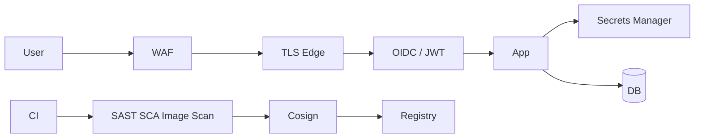

# Security

## 1. Overview

**What it is:** Protecting confidentiality, integrity, and availability across code, pipelines, runtime, and data.

**Why it exists:** Breaches are expensive; compliance and customer trust require systematic controls.

**When to use:** Every design review — security is a property of the system, not a phase.

**When NOT to:** Security theater (tools without ownership/process). Blocking all shipping without risk-based exceptions.

## 2. Concepts

- **OWASP Top 10** — injection, authn failures, XSS, SSRF, etc.
- **WAF / ModSecurity** — edge filtering
- **Browser controls** — CSP, HSTS, secure cookies, CORS
- **Identity** — JWT, OAuth2/OIDC, session vs token
- **mTLS** — mutual certificate auth between services
- **IAM / RBAC** — who can do what on which resource
- **Secrets management** — Vault, Infisical, cloud SM
- **Supply chain** — SBOM, signing, dependency pinning
- **Defense in depth** — layered controls

## 3. Architecture

## 4. Production Best Practices

- Threat model before build; STRIDE-lite for new services
- Least privilege everywhere (human + machine identities)
- Encrypt in transit and at rest; manage keys
- Patch cadence + vulnerability SLAs (CRITICAL 7d, etc.)
- Secure defaults: deny-by-default network, no public admin
- Security champions in each team; not only a central gate

## 5. Common Mistakes

| Mistake | Symptoms | Fix |
|---------|----------|-----|
| Secrets in git | Incident | Rotate + secret scanning |
| Over-permissive CORS `*` | Token theft risk | Explicit origins |
| Long-lived cloud keys | Silent abuse | OIDC/roles |
| No WAF on public apps | Opportunistic attacks | Managed WAF |
| JWT without revocability | Stolen forever | Short TTL + refresh |

## 6. Debugging Guide

- Auth failures: clock skew, audience/issuer mismatch, JWKS fetch
- CORS: preflight OPTIONS, Allow-Origin vs credentialed requests
- TLS: chain incomplete, SNI, cipher mismatch
- WAF false positive: review rule ID; tune carefully

## 7. Security (controls deep-dive)

- **Vault/Infisical:** dynamic DB creds, short TTLs, audit
- **RBAC:** map roles to duties; periodic access reviews
- **Image signing + admission**
- **CSP:** start report-only; tighten
- **HSTS:** only after HTTPS solid
- **ModSecurity CRS** with anomaly scoring

## 8. Performance

- Cache JWKS; connection reuse for mTLS
- WAF ruleset performance testing
- Avoid blocking scanners in critical path without async gates where policy allows

## 9. Real Production Example

OIDC login; API JWT 15m; refresh rotation; WAF on ALB; NetworkPolicies; Vault Agent injector; Trivy+Cosign; Dependabot; quarterly access review; bug bounty.

## 10. Interview Questions

**Beginner:** Authn vs authz? What is XSS?

**Intermediate:** Explain OAuth auth code + PKCE. CSP directives?

**Senior:** Zero-trust design. Key rotation without downtime. Detecting supply-chain compromise.

## 11. Checklist

- [ ] Threat model documented
- [ ] Secrets not in git; rotation tested
- [ ] TLS everywhere; HSTS/CSP as applicable
- [ ] WAF + rate limits public
- [ ] Vulnerability SLA process
- [ ] Backup restore tested (ransomware)

## 12. Cheat Sheet

| Control | Example |
|---------|---------|
| Headers | HSTS, CSP, X-Content-Type-Options |
| Tokens | Short JWT + refresh |
| Network | Default deny |
| Supply chain | SBOM + sign + scan |

## Related Skills

- [secrets-management](../secrets-management/SKILL.md)
- [ssl](../ssl/SKILL.md)
- [cicd](../cicd/SKILL.md)
- [kubernetes](../kubernetes/SKILL.md)
- [aws](../aws/SKILL.md)

---

**Author & maintainer:** Shanmukha Kumar Karra  
*Created and maintained as part of [AgentOps Kit](https://github.com/Shannuu2409/agentops-kit).*
