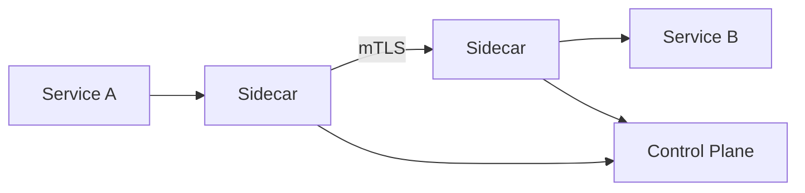

# Service Mesh

## 1. Overview

**What it is:** Infrastructure layer for **service-to-service** communication: mTLS, retries, timeouts, L7 routing, telemetry — often via sidecars (Envoy) or ambient proxies.

**When to use:** Many services needing uniform mTLS/traffic policy/observability without app rewrites.

**When NOT to:** Few services; team can't operate mesh complexity; Ingress + NetworkPolicy enough. Mesh is not free.

## 2. Concepts

- **Data plane** — proxies handling traffic
- **Control plane** — config distribution (Istiod)
- **Sidecar vs ambient/cni modes**
- **mTLS** permissive → strict
- **VirtualService / HTTPRoute** — routing, canary weights
- **Destination rules / retries / circuit breaking**
- **AuthZ policies**
- **Waypoint proxies** (ambient)

## 3. Architecture



## 4. Production Best Practices

- Adopt incrementally (one namespace)
- Start permissive mTLS; move to strict with metrics
- Centralize timeouts/retries carefully (avoid retry storms)
- Align with existing Ingress/Gateway API
- Budget for proxy CPU/mem
- Keep mesh version upgrade runbooks

## 5. Common Mistakes

| Mistake | Impact | Fix |
|---------|--------|-----|
| Retries everywhere | Amplify outages | Idempotent only; budgets |
| Big-bang mesh | Outage | Gradual rollout |
| Ignoring proxy resources | Throttling | Right-size |
| Mesh for north-south only | Overkill | Use gateway |

## 6. Debugging Guide

```bash
istioctl analyze
istioctl proxy-status
linkerd viz tap deploy/api
# Check mTLS
istioctl authn tls-check
```

Symptoms: 503 upstream, cert SPIFFE mismatch, CNI not ready.

## 7. Security

- Strict mTLS + AuthZ
- Disable privileged sidecars capabilities where possible
- Control plane RBAC hardened
- Certificate rotation automation

## 8. Performance

- Measure sidecar latency tax
- Connection pooling; HTTP/2
- Consider ambient to reduce per-pod sidecar cost

## 9. Real Production Example

Linkerd on EKS for mTLS + golden metrics; canary weights via SMI; Ingress still Nginx for north-south; gradual namespace install.

## 10. Interview Questions

**Beginner:** What problem does a mesh solve?

**Intermediate:** Sidecar vs ambient?

**Senior:** Mesh vs library micro-proxies tradeoffs. Multi-cluster mesh.

## 11. Checklist

- [ ] Clear goals (mTLS/traffic/telemetry)
- [ ] Pilot namespace success
- [ ] Resource budgets
- [ ] Upgrade plan
- [ ] Debug runbooks

## 12. Cheat Sheet

| Mesh | Strength |
|------|----------|
| Istio | Feature-rich, Gateway API |
| Linkerd | Simplicity, performance focus |
| Consul | HashiCorp ecosystem |

## Related Skills

- [kubernetes](../kubernetes/SKILL.md)
- [canary-deployment](../canary-deployment/SKILL.md)
- [ssl](../ssl/SKILL.md)
- [observability](../observability/SKILL.md)
- [networking](../networking/SKILL.md)

---

**Author & maintainer:** Shanmukha Kumar Karra  
*Created and maintained as part of [AgentOps Kit](https://github.com/Shannuu2409/agentops-kit).*
