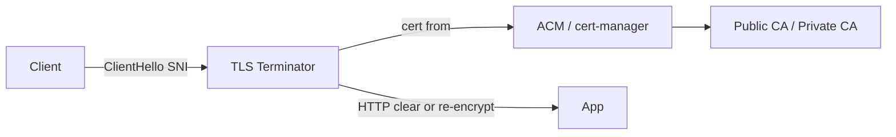

# SSL / TLS

## 1. Overview

**What it is:** **TLS** (successor to SSL) encrypts and authenticates network connections. People still say "SSL certificates" colloquially.

**When to use:** All external HTTP; preferably all internal traffic too (or mesh mTLS).

**When NOT to:** Inventing custom crypto; disabling verification to "fix" prod (except ephemeral debug with eyes open).

## 2. Concepts

- **Handshake** — negotiate version/ciphers; present certificate
- **X.509 certificates** — subject, SAN, issuer, validity
- **Chain of trust** — leaf → intermediates → trusted root
- **SNI** — host-based cert selection
- **ACME** — Let's Encrypt automation (HTTP-01 / DNS-01)
- **mTLS** — both sides present certs
- **OCSP stapling / CRL**
- **Cipher suites & TLS 1.2/1.3**

## 3. Architecture



## 4. Production Best Practices

- Automate issuance/renewal (cert-manager, ACM)
- Prefer TLS 1.2+ (1.3 where possible)
- Monitor expiry (alert at 14 days)
- Include all SANs; prefer short-lived certs
- HSTS only when HTTPS solid everywhere
- Private PKI for internal mTLS with automation

## 5. Common Mistakes

| Mistake | Symptoms | Fix |
|---------|----------|-----|
| Missing intermediate | Some clients fail | Install full chain |
| Clock skew | Verify errors | NTP |
| Wrong SAN | Name mismatch | Reissue with SAN |
| Expired | Sudden outage | Automation + alerts |
| TLS terminate then cleartext insecure net | Exposure | Encrypt again or private only |

## 6. Debugging Guide

```bash
openssl s_client -connect api.example.com:443 -servername api.example.com -showcerts
echo | openssl s_client -connect host:443 2>/dev/null | openssl x509 -noout -dates -subject -ext subjectAltName
curl -vI https://api.example.com
# SSL Labs for public endpoints (careful with rate)
```

Failure examples: `certificate has expired`, `unable to get local issuer certificate`, `hostname mismatch`.

## 7. Security

- Strong ciphers; disable legacy SSL/TLS1.0/1.1
- Protect private keys (HSM/KMS, file perms)
- CAA DNS records
- Certificate transparency monitoring
- Pinning rarely — prefer short-lived + CAA

## 8. Performance

- Session resumption; TLS 1.3 1-RTT
- OCSP stapling
- Hardware/offload where needed
- HTTP/2 over TLS

## 9. Real Production Example

cert-manager DNS-01 to Route53; ClusterIssuers staging/prod; certificates on Ingress; renewal 30d before expiry; BigPanda alert on `certmanager_certificate_expiration_timestamp_seconds`.

## 10. Interview Questions

**Beginner:** Symmetric vs asymmetric in TLS?

**Intermediate:** What is SNI? HTTP-01 vs DNS-01?

**Senior:** Private PKI at scale. mTLS identity (SPIFFE).

## 11. Checklist

- [ ] Automated renewals
- [ ] Expiry monitoring
- [ ] Full chain served
- [ ] TLS 1.2+ only
- [ ] Private keys protected

## 12. Cheat Sheet

| Tool | Use |
|------|-----|
| `openssl s_client` | Handshake debug |
| cert-manager | K8s certs |
| ACM | AWS certs |
| `sslscan` / testssl.sh | Cipher audit |

## Related Skills

- [dns](../dns/SKILL.md)
- [nginx](../nginx/SKILL.md)
- [security](../security/SKILL.md)
- [networking](../networking/SKILL.md)
- [troubleshooting](../troubleshooting/SKILL.md)
