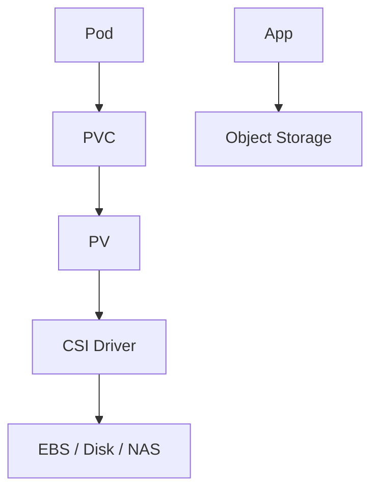

# Storage

## 1. Overview

**What it is:** Persisting bytes — **block** (EBS/PD), **file** (EFS/NFS), **object** (S3).

**When to use:** Databases (block), shared media (file), artifacts/backups (object).

**When NOT to:** Put databases on object storage directly unless product designed for it; use emptyDir for durable data.

## 2. Concepts

- **Durability vs availability**
- **IOPS / throughput / latency**
- **CSI drivers** in Kubernetes
- **PV / PVC / StorageClass**
- **Access modes** — RWO, ROX, RWX
- **Snapshots / clones**
- **Filesystem choice** — ext4/xfs
- **Object versioning & lifecycle**

## 3. Architecture



## 4. Production Best Practices

- Match volume type to workload (gp3/io2)
- Snapshots scheduled + restore tested
- Encryption by default
- Expandable StorageClasses; monitor free space/inodes
- Object lifecycle to IA/Glacier
- Backup out of account for ransomware

## 5. Common Mistakes

| Mistake | Fix |
|---------|-----|
| RWX needed but RWO disk | Use NFS/EFS or redesign |
| No space alerts | Alert at 70/85% |
| Snapshots never restored | Game day |
| HostPath in prod | Prefer CSI |

## 6. Debugging Guide

```bash
kubectl get pvc,pv,sc
kubectl describe pvc data
# Node
df -h; lsblk; dmesg | grep -i error
```

Attach failures: IAM, zone mismatch (RWO volume wrong AZ), capacity.

## 7. Security

- Encrypt; KMS CMKs for sensitive
- Block public S3; VPC endpoints
- Least privilege IAM for CSI roles

## 8. Performance

- Benchmark realistic IO; watch queue depth
- Separate WAL/data disks when advised
- Avoid noisy neighbor on shared NAS for DBs

## 9. Real Production Example

EBS gp3 for Postgres via CSI; daily snapshots to DR account; S3 versioned for backups; EFS for shared CMS uploads only.

## 10. Interview Questions

**Beginner:** Block vs object?

**Intermediate:** PVC pending causes?

**Senior:** Design multi-AZ storage for stateful K8s.

## 11. Checklist

- [ ] Encryption + snapshots
- [ ] StorageClass defaults sane
- [ ] Capacity alerts
- [ ] Backup restore tested
- [ ] AZ affinity understood

## 12. Cheat Sheet

| Type | Example | Use |
|------|---------|-----|
| Block | EBS | DB |
| File | EFS | Shared files |
| Object | S3 | Artifacts |

## Related Skills

- [kubernetes](../kubernetes/SKILL.md)
- [databases](../databases/SKILL.md)
- [disaster-recovery](../disaster-recovery/SKILL.md)
- [performance](../performance/SKILL.md)
