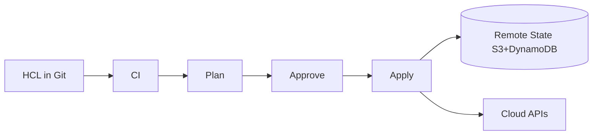

# Terraform

## 1. Overview

**What it is:** HashiCorp Terraform (and OpenTofu) declare cloud infrastructure as code and apply changes via providers.

**Why it exists:** Click-ops drifts; IaC is reviewable, repeatable, and recoverable.

**When to use:** Cloud resources (VPC, IAM, EKS, RDS), multi-env promotion with modules.

**When NOT to use:** Day-2 app config inside VMs (Ansible); ultra-dynamic app routing (K8s controllers). Avoid dual-managing the same object in Terraform and a console.

## 2. Concepts

- **Provider** — AWS/Azure/GCP/K8s APIs
- **Resource / data source** — create vs read
- **State** — mapping of resources to real IDs; **must be remote + locked** in teams
- **Plan / Apply / Destroy** — preview then mutate
- **Module** — reusable composition
- **Variables / outputs / locals**
- **Workspaces** — alternate state keys (use carefully; often separate dirs/backends preferred)
- **Drift** — reality changed outside Terraform

## 3. Architecture



## 4. Production Best Practices

- Remote state + locking (S3+DynamoDB, Terraform Cloud, GCS)
- Least-privilege CI roles; plan on PR, apply on main with approval
- Pin provider and module versions
- Small blast-radius root modules per domain (network ≠ app)
- `terraform fmt` + `validate` + `tflint` + `tfsec`/`checkov` in CI
- Never commit `.tfstate` or secrets; use secret stores / OIDC
- Prefer `for_each` over count for stable addresses

## 5. Common Mistakes

| Mistake | Symptoms | Fix |
|---------|----------|-----|
| Local state in team | Overwrites | Remote backend |
| Manual console change | Drift / failed apply | Refresh + import or adopt |
| Huge monolith root | Slow risky plans | Split states |
| Secrets in tfvars git | Leak | Env/OIDC/Vault |
| Force-unlock casually | Corruption risk | Only when lock holder dead |

## 6. Debugging Guide

```bash
terraform init -upgrade
terraform plan -out=tfplan
terraform show tfplan
terraform state list
terraform state show aws_instance.web
TF_LOG=INFO terraform apply   # careful: verbose
```

Import existing: `terraform import addr id` then align config.

## 7. Security

- State contains secrets — encrypt backend, restrict IAM read
- Policy as code (OPA/Sentinel/checkov)
- Separate prod accounts; prevent apply from feature branches
- Provider assume-role with short credentials

## 8. Performance

- `-parallelism` carefully; refresh selective
- Avoid huge `data` fan-out each plan
- Module caching in CI; provider plugin cache

## 9. Real Production Example

GitHub Actions OIDC → AWS; PR runs `plan` and posts comment; main applies network and platform stacks; app stacks depend via remote state data sources; Checkov gate; drift detection weekly.

## 10. Interview Questions

**Beginner:** What is state? plan vs apply?

**Intermediate:** count vs for_each? How locking works?

**Senior:** Multi-account landing zone design. State migration. Refactor modules without downtime.

## 11. Checklist

- [ ] Remote state + lock + encryption
- [ ] Version pins; CI fmt/validate/security
- [ ] No secrets in git
- [ ] Apply protected; PR plan only
- [ ] Document destroy protections (`prevent_destroy`)

## 12. Cheat Sheet

| Command | Purpose |
|---------|---------|
| `terraform init` | Backend/providers |
| `terraform plan` | Preview |
| `terraform apply` | Mutate |
| `terraform fmt -recursive` | Format |
| `terraform state rm` | Stop managing |

See also: [ci-oidc-example.md](ci-oidc-example.md)

## Related Skills

- [ansible](../ansible/SKILL.md)
- [aws](../aws/SKILL.md)
- [cicd](../cicd/SKILL.md)
- [security](../security/SKILL.md)
- [github-actions](../github-actions/SKILL.md)
