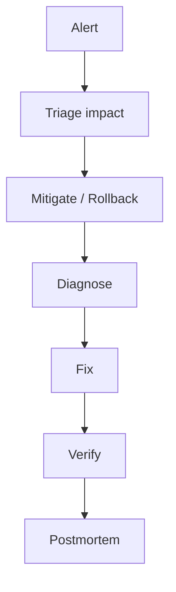

# Troubleshooting

## 1. Overview

**What it is:** A systematic approach to restoring service: observe → localize → hypothesize → fix → verify → prevent.

**Why it exists:** Tools differ; method stays the same. Runbooks cut MTTR.

**When to use:** Any incident or persistent failure.

**When NOT to:** Changing random configs without evidence — that creates new incidents.

## 2. Concepts

- **Symptom vs cause** — 502 is symptom; upstream timeout is cause
- **Blast radius** — one pod vs whole region
- **Recent change** — deploy, cert renew, DNS, IAM
- **Golden signals** — latency, traffic, errors, saturation
- **Bisect** — last known good
- **Preserve evidence** — logs/timestamps before restart panic

## 3. Architecture (incident flow)

## 4. Production Best Practices

- Declare IC; communicate early
- Mitigate first (rollback/flag) if SLO burning
- One change at a time while diagnosing
- Write timeline; capture commands/output
- Link alerts to these runbooks

## 5. Common Mistakes

| Mistake | Fix |
|---------|-----|
| Restart loops without logs | `logs --previous` first |
| Blame app while DNS broken | Check resolution early |
| Fixing prod without rollback path | Always know undo |
| No postmortem | Recurrence guaranteed |

## 6. Debugging Guide — Master Checklist

1. What is user impact? Since when?
2. What changed? (deploy, config, cert, traffic)
3. Is it DNS / TLS / network / auth / app / data?
4. One request: capture `curl -v`, trace_id, pod name
5. Mitigate → root cause → permanent fix

## 7. Security

- Don't paste secrets into tickets/chat
- Prefer break-glass audited access
- Assume breach if unexplained admin activity

## 8. Performance

- Distinguish brownout (slow) vs hard down
- Saturation often looks like "random 5xx"

## 9. Real Production Example

SEV1 checkout errors: canary at 25% showed 5xx; auto-abort restored stable in 3m; root cause bad config key; postmortem added config schema validation in CI.

## 10. Interview Questions

**Beginner:** First steps when site is down?

**Intermediate:** Debug CrashLoopBackOff end-to-end.

**Senior:** Design incident management for multi-team platforms.

## 11. Checklist

- [ ] Impact & IC declared
- [ ] Mitigation applied if needed
- [ ] Evidence preserved
- [ ] Root cause documented
- [ ] Follow-ups ticketed

## 12. Cheat Sheet — Runbook Index

| Failure | Section / file |
|---------|----------------|
| Docker | [runbooks-docker.md](runbooks-docker.md) |
| K8s CrashLoop / OOM / ImagePull | [runbooks-kubernetes.md](runbooks-kubernetes.md) |
| GitHub Actions | [runbooks-github-actions.md](runbooks-github-actions.md) |
| DNS / SSL | [runbooks-dns-ssl.md](runbooks-dns-ssl.md) |
| Nginx / Kong / 5xx | [runbooks-proxy-5xx.md](runbooks-proxy-5xx.md) |
| Database / performance | [runbooks-db-perf.md](runbooks-db-perf.md) |

## Related Skills

- [kubernetes](../kubernetes/SKILL.md)
- [docker](../docker/SKILL.md)
- [nginx](../nginx/SKILL.md)
- [dns](../dns/SKILL.md)
- [ssl](../ssl/SKILL.md)
- [observability](../observability/SKILL.md)
- [rollback-strategies](../rollback-strategies/SKILL.md)
